# H8 Capability-Aware Ambulance Dispatch: Architecture and Build Spec

Purpose: a single source of truth that Antigravity agents (and you) can build from. Put this file at `docs/ARCHITECTURE.md`, and copy section 0.2 into `AGENTS.md` at the repo root. Diagrams are Mermaid, so they render in the IDE markdown preview and on GitHub.

Scope reminder: synthetic data only, human dispatcher confirms every assignment, decision-support research, not for live emergency calls.

---

## 0. How to use this in Antigravity

### 0.1 Workflow
1. Create the repo `h8-ems-platform`, add this file under `docs/`.
2. Open the folder in Antigravity. Use Planning mode for each phase in section 14, one phase per agent task, and review the plan and diff before accepting.
3. Run one agent per Maven module where possible (common, simulator, dispatch-service...), because the modules are decoupled by the dependency rules in section 2.
4. Keep terminal command approval on "ask" for anything that installs packages or touches Docker.
5. After each phase, run the acceptance command listed for that phase before starting the next.

Check Antigravity's own docs for where it reads project rules and reusable workflows (for example a rules or workflows folder); `AGENTS.md` at the root is the safest portable choice.

### 0.2 Rules block for `AGENTS.md`

```
Project: H8 capability-aware ambulance dispatch (Java 21, Spring Boot 3, Maven multi-module).
Hard rules:
1. `common` and `simulator` must NOT depend on Spring, JPA, Kafka or Redis. Plain Java 21 only.
2. DispatchScorer, CoverageModel, DestinationRanker live only in `common`. Services and simulator import them. Never copy them.
3. A unit is reserved only by a conditional UPDATE (status = AVAILABLE). Never read-then-write.
4. Every Kafka consumer is idempotent (dedupe on eventId). Every state change that must be published uses the outbox table.
5. All unit positions and hospital capacities carry a timestamp and TTL. Stale data is penalised or ignored, never trusted.
6. No real patient or caller data. Caller phone is stored only as a salted hash.
7. Simulator runs are deterministic for a given seed. Use common random numbers across policies.
8. Every new class gets a unit test. Concurrency, state machine and scorer get property tests (jqwik).
9. Do not invent library APIs. Check GraphHopper, Spring Data Redis, Keycloak docs for the pinned version.
10. Never commit secrets. Use .env.example and Docker secrets.
```

---

## 1. System context

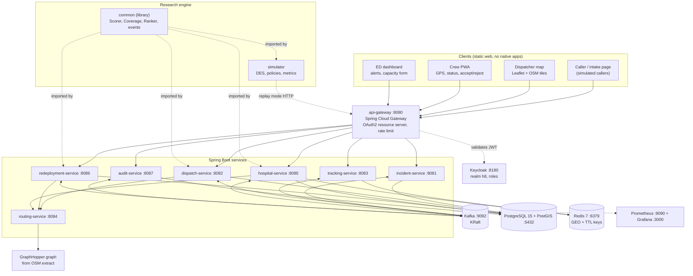

### 1.1 Layered view (easier to read than the graph above)

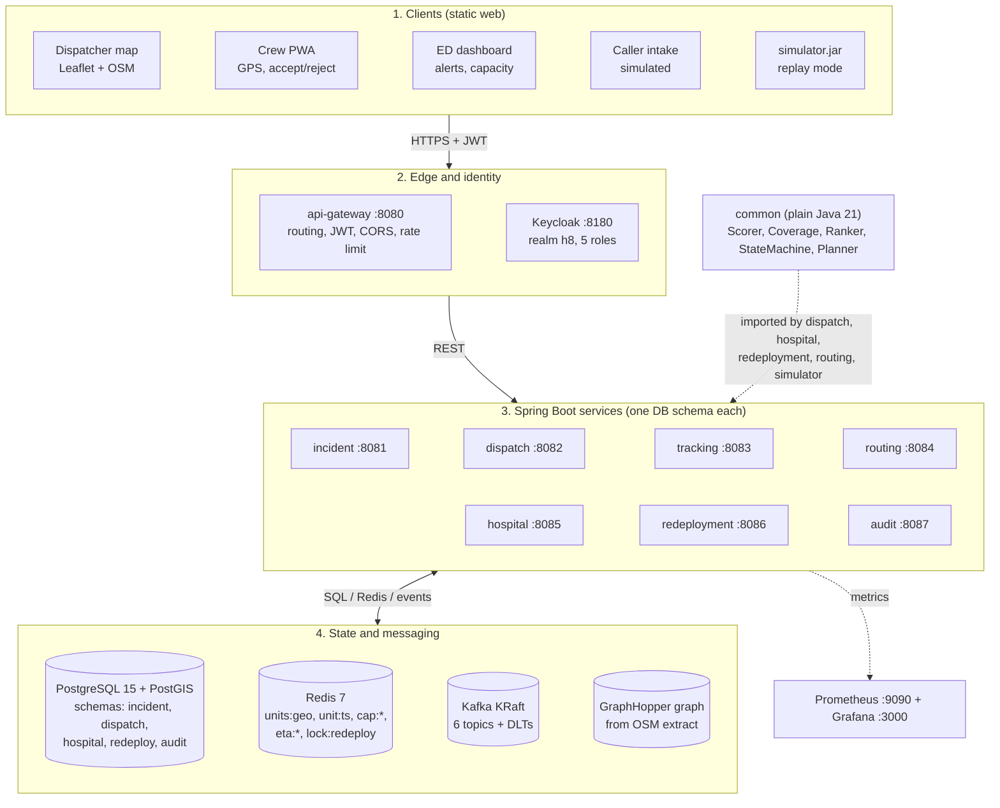

---

## 2. Maven modules and dependency rules

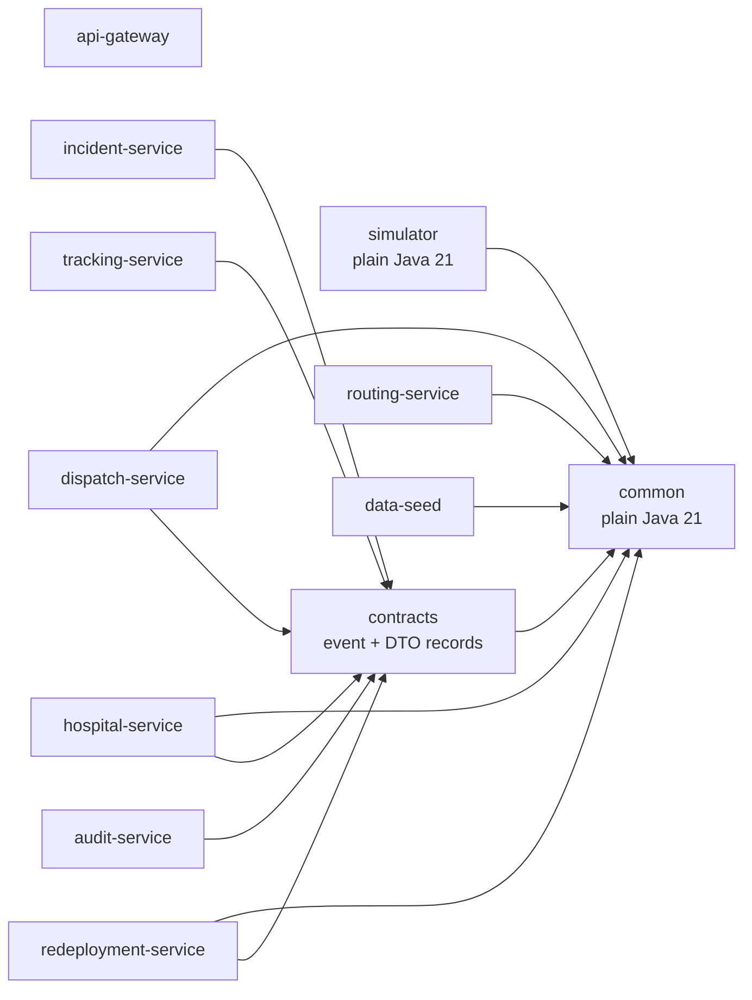

Rules: arrows are the only allowed dependencies. No service depends on another service module; they talk via REST (only for routing ETA) or Kafka. `contracts` holds Kafka event records and REST DTOs only (no logic). `routing-service` exposes `EtaProvider` over HTTP so the other services call one place.

Repository layout (adds `contracts` and `api-gateway` to the original guide):

```
h8-ems-platform/
  pom.xml                       parent, pins versions, Java 21
  docker-compose.yml
  .env.example
  AGENTS.md
  common/                       GeoPoint, enums, DispatchScorer, CoverageModel, DestinationRanker,
                                UnitStateMachine, EtaProvider interface, HaversineEta
  contracts/                    event records, REST DTOs, JSON schema
  api-gateway/
  incident-service/
  dispatch-service/
  tracking-service/
  routing-service/              GraphHopperEta + HTTP controller, fallback to HaversineEta
  hospital-service/
  redeployment-service/
  audit-service/
  data-seed/                    synthetic stations, units, hospitals, zone grid
  simulator/                    DES engine, policies, demand, metrics, runner (CLI jar)
  web/                          dispatcher/, crew/, ed/ (static HTML + JS + Leaflet)
  data/                         OSM extract config, zone grid csv, hospital seed json
  experiments/                  scenarios/*.yaml, seeds, plot scripts, results/
  ops/                          prometheus.yml, grafana dashboards, keycloak realm export
  docs/                         ARCHITECTURE.md, paper/
```

---

## 3. Primary flow: incident to dispatch

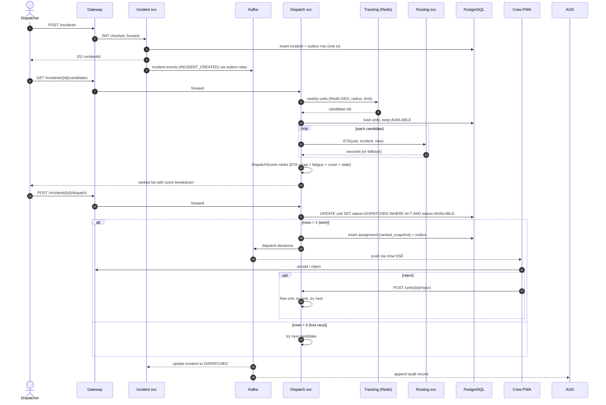

## 4. Hospital pre-arrival and handover flow

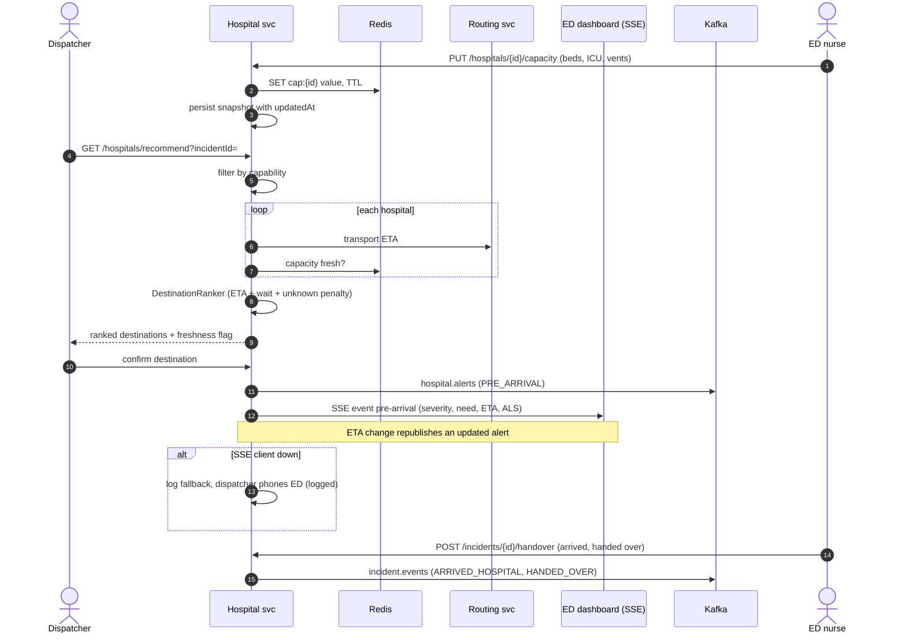

## 5. State machines

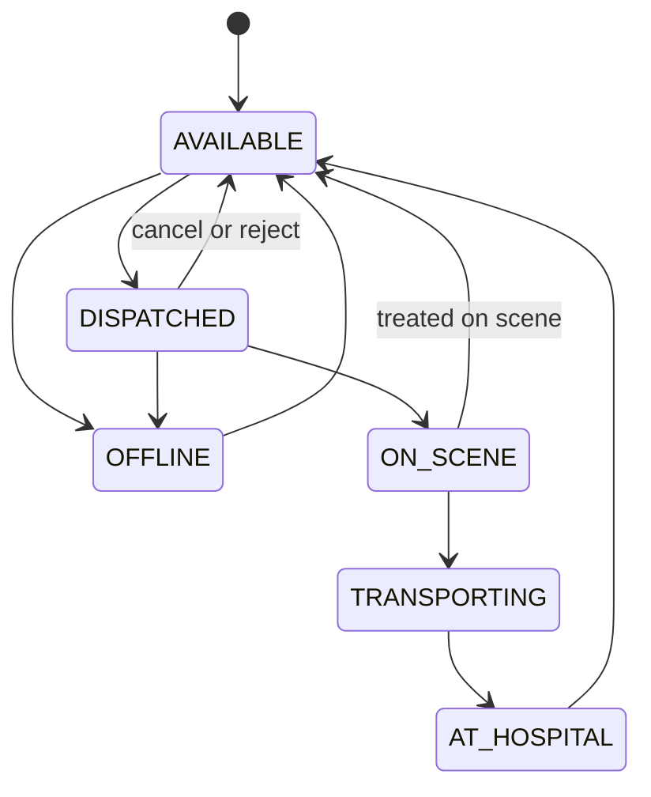

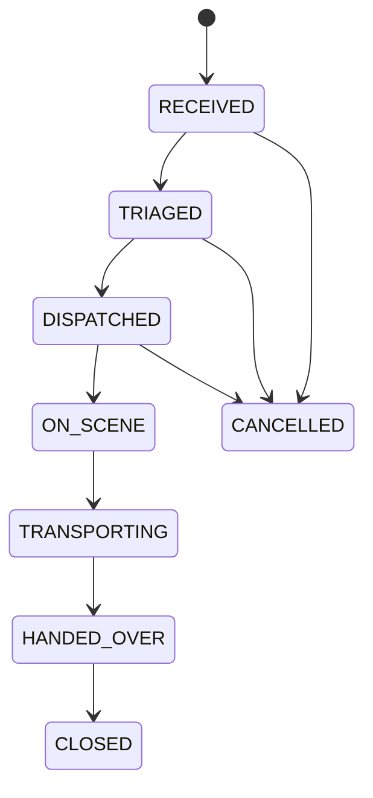

Unit transitions are enforced by `UnitStateMachine` in `common` and again by a database CHECK via the transition API. Illegal transitions return HTTP 409.

---

## 6. Data model (PostgreSQL + PostGIS)

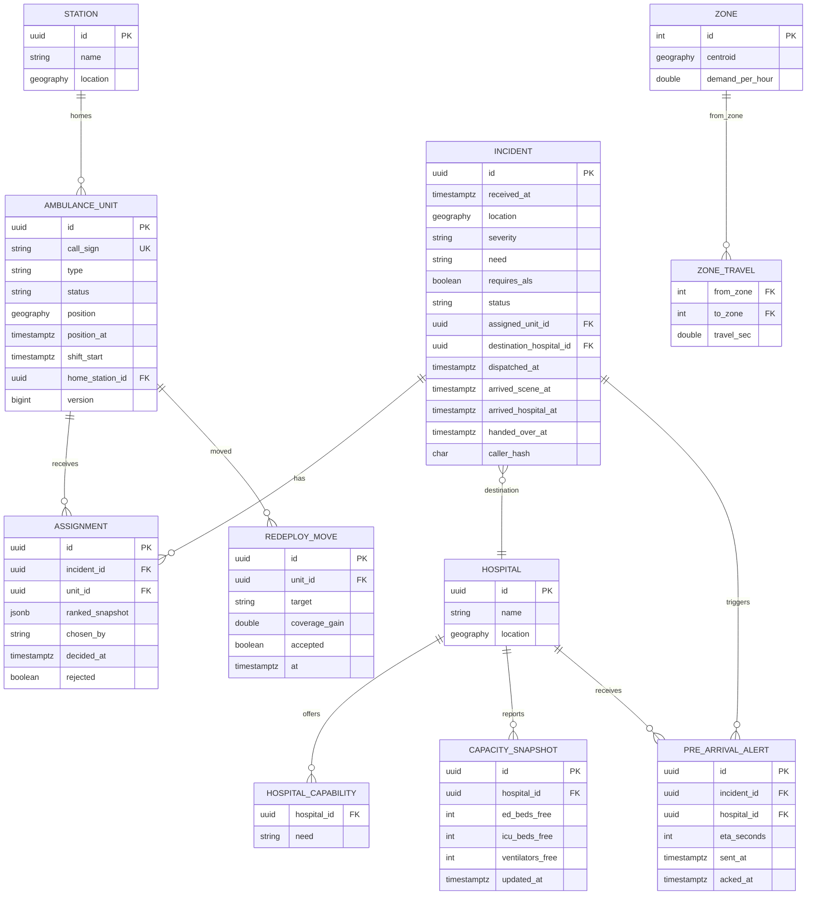

Infrastructure tables (not in the original guide, required by the fault-tolerance design):

```sql
CREATE TABLE outbox_event (
  id UUID PRIMARY KEY, aggregate_id UUID NOT NULL, topic VARCHAR(64) NOT NULL,
  event_key VARCHAR(64) NOT NULL, payload JSONB NOT NULL,
  created_at TIMESTAMPTZ NOT NULL DEFAULT now(), published_at TIMESTAMPTZ
);
CREATE INDEX idx_outbox_unpub ON outbox_event (created_at) WHERE published_at IS NULL;

CREATE TABLE processed_event (
  consumer VARCHAR(64) NOT NULL, event_id UUID NOT NULL,
  processed_at TIMESTAMPTZ NOT NULL DEFAULT now(), PRIMARY KEY (consumer, event_id)
);

CREATE TABLE audit_log (
  seq BIGSERIAL PRIMARY KEY, event_id UUID UNIQUE NOT NULL, kind VARCHAR(32) NOT NULL,
  actor VARCHAR(64), payload JSONB NOT NULL, prev_hash CHAR(64), hash CHAR(64) NOT NULL,
  at TIMESTAMPTZ NOT NULL DEFAULT now()   -- hash = SHA-256(prev_hash || payload || at); append-only (revoke UPDATE/DELETE)
);
```

Ownership: each table is written by exactly one service (incident: incident; dispatch: assignment, unit status; hospital: capacity_snapshot, pre_arrival_alert; redeployment: redeploy_move; audit: audit_log). Use Flyway migrations per service schema (`incident`, `dispatch`, `hospital`, `redeploy`, `audit`) in one PostgreSQL instance.

---

## 7. Messaging (Kafka)

| Topic | Key | Partitions | Producer | Consumers | Payload (contracts) |
|---|---|---|---|---|---|
| `incident.events` | incidentId | 6 | incident, hospital | dispatch, audit, redeployment | `IncidentEvent{eventId, type, incidentId, at, body}` |
| `unit.location` | unitId | 12 | gateway (crew posts) | tracking | `LocationUpdate{unitId, lat, lon, epochMs, speed}` |
| `unit.status` | unitId | 6 | dispatch, tracking | incident, redeployment, audit | `UnitStatusEvent{eventId, unitId, from, to, at}` |
| `dispatch.decisions` | incidentId | 6 | dispatch | incident, hospital, crew gateway, audit | `DispatchDecision{eventId, incidentId, unitId, chosenBy, ranked[]}` |
| `hospital.alerts` | hospitalId | 3 | hospital | audit, ED SSE hub | `PreArrivalAlert{...}` |
| `audit.events` | incidentId | 3 | all services | audit | `AuditEvent{eventId, kind, actor, payload}` |
| `*.DLT` | same | 1 | error handlers | ops | failed messages with exception header |

### 7.1 Topic flow

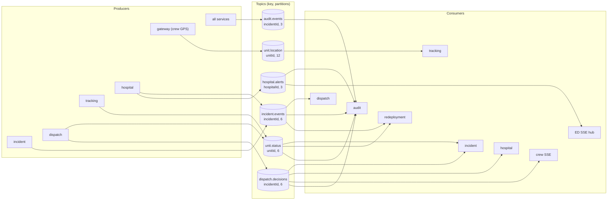

Conventions: JSON with a `schemaVersion` field; every message has `eventId` (UUID) for dedupe; producers use `acks=all`, idempotent producer on; consumers use manual offset commit after the DB transaction; retries with backoff then DLT. `unit.location` is lossy by design (latest wins), so it is the only topic where out-of-order records are dropped silently.

## 8. Redis key design

| Key | Type | TTL | Writer | Purpose |
|---|---|---|---|---|
| `units:geo` | GEO sorted set | none (members pruned by job) | tracking | nearby-unit search |
| `unit:ts:{unitId}` | string (epochMs) | 90 s | tracking | heartbeat, out-of-order guard |
| `unit:state:{unitId}` | hash | none | dispatch | cached status, avoid DB on rank path |
| `cap:{hospitalId}` | hash | configurable (default 15 min) | hospital | capacity with freshness |
| `eta:{from}:{to}:{bucket}` | string | 60 s | routing | ETA cache (rounded cell + 5-min bucket) |
| `lock:redeploy` | string | 30 s | redeployment | single active rebalancer (SET NX PX) |

Scheduled pruner (tracking): every 30 s, for each member of `units:geo` whose `unit:ts:*` is missing, `ZREM` it and publish `UnitStatusEvent(... OFFLINE)`.

---

## 9. Service contracts

| Service | Port | Owns | REST (via gateway) | Roles |
|---|---|---|---|---|
| api-gateway | 8080 | routing, JWT validation, CORS, rate limits | all paths below | n/a |
| incident | 8081 | incident table | `POST /incidents`, `GET /incidents/{id}`, `POST /incidents/{id}/cancel`, `POST /incidents/{id}/handover` | DISPATCHER, ED_STAFF |
| dispatch | 8082 | assignment, unit status | `GET /incidents/{id}/candidates`, `POST /incidents/{id}/dispatch`, `POST /incidents/{id}/override`, `POST /units/{id}/status`, `POST /units/{id}/reject` | DISPATCHER, CREW |
| tracking | 8083 | Redis positions | `POST /units/{id}/location` (batched), `GET /units/nearby` (internal) | CREW |
| routing | 8084 | graph | `POST /eta` (internal), `POST /eta/matrix` (internal) | service token |
| hospital | 8085 | capacity, alerts | `PUT /hospitals/{id}/capacity`, `GET /hospitals/recommend`, `GET /hospitals/{id}/alerts` (SSE) | ED_STAFF, DISPATCHER |
| redeployment | 8086 | moves | `GET /coverage`, `POST /redeploy/run` (manual trigger) | SUPERVISOR |
| audit | 8087 | audit_log | `GET /metrics/summary`, `GET /audit?incidentId=` | SUPERVISOR, AUDITOR |

Cross-cutting API rules: all errors use RFC 7807 `application/problem+json`; all POSTs that create things accept an `Idempotency-Key` header; all timestamps are ISO-8601 UTC; list endpoints are paginated; OpenAPI spec generated by springdoc and checked into `contracts/openapi/`.

Crew push channel: `GET /units/{id}/events` (SSE) fed by `dispatch.decisions` and redeploy suggestions; crew PWA falls back to polling every 5 s.

Internal calls: only `dispatch -> routing`, `hospital -> routing`, `redeployment -> routing`, over HTTP with a 300 ms timeout, circuit breaker (Resilience4j), and fallback to `HaversineEta`.

---

## 10. Core library design (`common`)

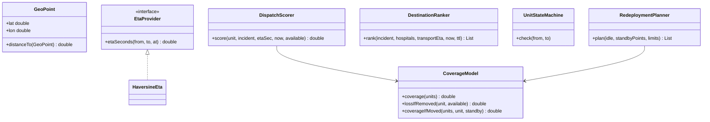

Design notes:
- Domain objects in `common` are plain records/POJOs (`UnitSnapshot`, `IncidentSnapshot`, `HospitalSnapshot`). JPA entities in the services map to and from these snapshots. This keeps `common` free of JPA annotations, which the original guide's entity code mixed with scoring logic.
- `RedeploymentPlanner` is new: the greedy loop from the guide's `RedeploymentService` moves into `common` so the simulator uses identical logic. The service only schedules it and pushes suggestions.
- All scorer parameters live in one `Params` record loaded from YAML, so experiments E5 (sensitivity) just swap config files.

## 11. Simulator design

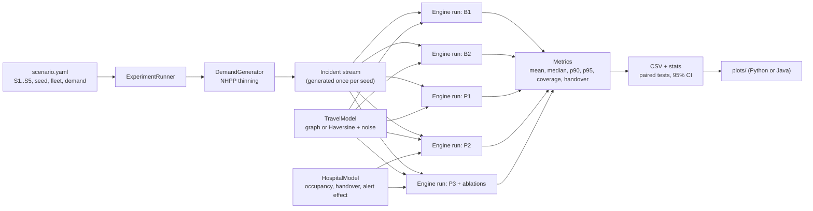

Rules: one incident stream per (scenario, seed), reused by every policy (common random numbers). Random draws for scene time, noise and handover are pre-sampled per incident id, so a policy that serves an incident later or with a different unit does not shift the random sequence for others. Output one row per incident per policy per seed so any statistic can be recomputed.

Two modes: `batch` (pure in-process, fast) and `replay` (the same stream drives the live HTTP APIs with simulated GPS, for end-to-end demos and E6/E7).

---

## 12. Deployment topology

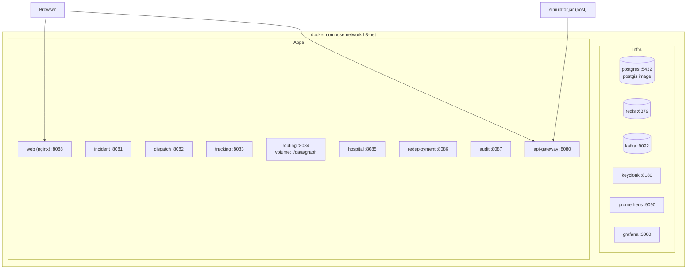

Compose skeleton (pin image tags to versions you verify; do not use `latest`):

```yaml
name: h8
services:
  postgres:
    image: postgis/postgis:15-3.4
    environment: { POSTGRES_DB: h8, POSTGRES_USER: h8, POSTGRES_PASSWORD: ${PG_PASSWORD} }
    volumes: [ "pgdata:/var/lib/postgresql/data" ]
    healthcheck: { test: ["CMD-SHELL","pg_isready -U h8"], interval: 5s, retries: 10 }
  redis:
    image: redis:7
    healthcheck: { test: ["CMD","redis-cli","ping"], interval: 5s, retries: 10 }
  kafka:
    image: apache/kafka:3.7.0          # single-node KRaft for dev
    environment:
      KAFKA_NODE_ID: 1
      KAFKA_PROCESS_ROLES: broker,controller
      KAFKA_LISTENERS: PLAINTEXT://:9092,CONTROLLER://:9093
      KAFKA_ADVERTISED_LISTENERS: PLAINTEXT://kafka:9092
      KAFKA_CONTROLLER_QUORUM_VOTERS: 1@kafka:9093
      KAFKA_CONTROLLER_LISTENER_NAMES: CONTROLLER
      KAFKA_OFFSETS_TOPIC_REPLICATION_FACTOR: 1
  keycloak:
    image: quay.io/keycloak/keycloak:25.0
    command: start-dev --import-realm
    volumes: [ "./ops/keycloak:/opt/keycloak/data/import" ]
    ports: [ "8180:8080" ]
  dispatch-service:
    build: ./dispatch-service
    depends_on: { postgres: {condition: service_healthy}, redis: {condition: service_healthy}, kafka: {condition: service_started} }
    environment: { SPRING_PROFILES_ACTIVE: docker, ROUTING_URL: http://routing-service:8084 }
  # repeat the pattern for incident, tracking, routing, hospital, redeployment, audit, api-gateway
  prometheus: { image: prom/prometheus, volumes: ["./ops/prometheus.yml:/etc/prometheus/prometheus.yml"], ports: ["9090:9090"] }
  grafana: { image: grafana/grafana, ports: ["3000:3000"] }
volumes: { pgdata: {} }
```

Configuration: each service has `application.yml` (defaults), `application-docker.yml` (container hostnames), `application-test.yml` (Testcontainers). Scorer, TTL, redeployment limits and traffic factors come from `config/h8-params.yml` mounted into services and read by the simulator, so the numbers are identical in both.

---

## 13. Cross-cutting design

### 13.1 Fault tolerance (what experiment E6 will test)
| Failure | Mechanism | Expected outcome |
|---|---|---|
| Two dispatchers pick one unit | conditional UPDATE | exactly one wins, loser re-ranks |
| Dispatch service dies after reserve, before publish | outbox row written in same transaction | event published after restart, none lost |
| Kafka down | outbox accumulates, relay retries | no lost incidents, delayed events |
| Duplicate Kafka delivery | `processed_event` dedupe | applied once |
| Crew GPS gap | heartbeat TTL, stale penalty, then exclusion | unit ranked lower, then OFFLINE |
| Crew device offline then reconnects | batched upload with timestamps, out-of-order ignored | latest position wins |
| Stale hospital capacity | TTL + unknown penalty | still routed, flagged as unknown |
| Routing engine down | circuit breaker, `HaversineEta` fallback | degraded ETA, no outage |
| ED dashboard unreachable | alert logged as undelivered, dispatcher prompted to phone | fallback recorded in audit |

### 13.2 Security
- Keycloak realm `h8` with roles DISPATCHER, CREW, ED_STAFF, SUPERVISOR, AUDITOR. Gateway validates JWT; services re-validate (defence in depth).
- Crew tokens carry a `unit_id` claim; `POST /units/{id}/location` rejects when path id differs from claim.
- ED tokens carry `hospital_id`; ED staff can only touch their hospital.
- Service-to-service: client-credentials tokens for routing calls.
- Audit log is append-only: database role without UPDATE/DELETE, hash chain verified by a nightly job.

### 13.3 Observability
Micrometer metrics to expose: `dispatch_decision_seconds` (histogram), `dispatch_reservation_conflicts_total`, `location_ingest_per_sec`, `kafka_consumer_lag`, `coverage_ratio` (gauge), `stale_units`, `capacity_stale_hospitals`, `alert_delivery_seconds`, `outbox_pending`. Trace id propagated in Kafka headers and HTTP (`traceparent`). Provide one Grafana dashboard JSON in `ops/grafana/`.

### 13.4 Testing pyramid
Unit and property tests in `common`; Testcontainers integration tests for dispatch (Postgres + Kafka + Redis); a two-thread reservation race test; Spring Security tests for roles; determinism test for the simulator (same seed twice gives identical output); Gatling scenarios for E7.

---

## 14. Build plan for Antigravity (phases, prompts, acceptance)

### 14.0 Roadmap at a glance

```mermaid
flowchart LR
  P0["Phase 0<br/>Skeleton<br/>pom, compose, ArchUnit"] --> P1["Phase 1<br/>common library<br/>scorer, coverage, ranker"]
  P1 --> P2["Phase 2<br/>simulator<br/>DES, policies, CSV"]
  P2 --> P3["Phase 3<br/>Data + incident + routing<br/>outbox"]
  P3 --> P4["Phase 4<br/>tracking + dispatch<br/>conditional UPDATE"]
  P4 --> P5["Phase 5<br/>hospital, redeploy<br/>GraphHopper"]
  P5 --> P6["Phase 6<br/>gateway, Keycloak<br/>web pages"]
  P6 --> P7["Phase 7<br/>audit, metrics<br/>fault injection"]
  P7 --> P8["Phase 8<br/>experiments E1-E8<br/>paper"]
  classDef core fill:#DFF3E3,stroke:#2F7D4A
  classDef end1 fill:#FDE8D7,stroke:#C05621
  class P0,P1,P2 core
  class P8 end1
```

Green phases are plain Java (no Spring, no Docker). Build them first.

Give each phase to an agent as a task. The prompt text is meant to be pasted; adjust names if you change the layout.

### Phase 0: skeleton (day 1)
Prompt: "Read docs/ARCHITECTURE.md and AGENTS.md. Create the Maven parent pom (Java 21, Spring Boot 3.x BOM, JUnit 5, Testcontainers, jqwik) and empty modules exactly as in section 2 with the allowed dependencies only. Add docker-compose.yml with postgres, redis, kafka, keycloak, prometheus, grafana per section 12, a .env.example, and a Makefile with `up`, `down`, `test`. Do not write business logic."
Accept: `./mvnw -q verify` passes; `docker compose up -d postgres redis kafka` is healthy; a dependency-rule test (ArchUnit) fails if `common` imports Spring.

### Phase 1: `common` library
Prompt: "Implement in `common` (plain Java 21): GeoPoint, enums, snapshot records, UnitStateMachine, EtaProvider, HaversineEta, CoverageModel (including coverageIfMoved), DispatchScorer with a Params record, DestinationRanker, RedeploymentPlanner. Follow section 10 and the formulas in the project guide. Write JUnit tests and jqwik properties: coverage never decreases when a unit is added, score is monotone in ETA, illegal transitions always rejected, planner respects MAX_MOVES, MIN_GAIN and cool-down."
Accept: all tests green; coverage of `common` above 85%.

### Phase 2: simulator
Prompt: "Implement `simulator` per section 11: DemandGenerator (non-homogeneous Poisson via thinning, zone CDF), sealed SimEvent engine with PriorityQueue, TravelModel (Haversine plus log-normal noise first), HospitalModel, policies B1, B2, P1, P2, P3 and ablation flags, Metrics (mean, median, p90, p95, within-target, coverage over time, handover delay), ExperimentRunner CLI reading scenario YAML, CSV output per incident. Pre-sample per-incident random draws for common random numbers. Add a determinism test."
Accept: `java -jar simulator.jar --mode=batch --scenarios=S1 --policies=B1,B2,P1 --reps=5 --out=experiments/results` produces CSVs; running it twice with the same seed gives identical files; B1 produces plausible response times (sanity check, then calibrate in week 6).

### Phase 3: data layer and core services
Prompt: "Create Flyway migrations from section 6 (schemas per service, outbox_event, processed_event, audit_log). Implement incident-service and routing-service (HTTP /eta with circuit breaker fallback to HaversineEta; GraphHopper behind the same interface can be a stub until Phase 5). Implement the outbox relay as a reusable starter in `contracts` or a small shared module without business logic."
Accept: creating an incident writes incident + outbox in one transaction and the event appears on `incident.events`; killing Kafka and restarting loses nothing.

### Phase 4: tracking and dispatch
Prompt: "Implement tracking-service (Kafka consumer on unit.location, Redis GEO add, out-of-order guard, heartbeat TTL, pruner job that removes expired members and emits OFFLINE) and dispatch-service (rank using common DispatchScorer, reserveIfAvailable conditional UPDATE, assignment with ranked_snapshot, outbox publish, reject and re-dispatch, override with reason). Per section 3. Widen the Redis nearby radius for rural scenarios via config."
Accept: concurrency test with 50 threads reserving one unit gives exactly one success; location replay with shuffled timestamps keeps latest position; dispatch latency p95 under 200 ms locally.

### Phase 5: hospital, redeployment, routing graph
Prompt: "Implement hospital-service (capacity PUT with Redis TTL and DB snapshot, recommend endpoint using DestinationRanker, SSE AlertHub with reconnect support via Last-Event-ID, handover endpoint) and redeployment-service (scheduled RedeploymentPlanner under a Redis lock, push suggestions, record moves). Then implement GraphHopperEta against the pinned library version from the official docs, loading an OSM extract from data/graph, with time-of-day factor."
Accept: ED dashboard receives an alert within 1 s of dispatch confirm; only one redeployment instance acts when two run; routing returns ETA from the real graph and falls back when stopped.

### Phase 6: gateway, security, web
Prompt: "Implement api-gateway (route table from section 9, JWT validation, CORS, rate limit), import the Keycloak realm with the five roles and sample users, add role checks in every service, then build static pages in web/: dispatcher map (Leaflet, candidate list with score breakdown, confirm/override), crew PWA (GPS watcher with offline buffer, accept/reject, status buttons), ED dashboard (capacity form, alert cards with audio cue, incoming board)."
Accept: Spring Security tests prove a CREW token for unit A cannot post for unit B; the three pages work end to end against compose.

### Phase 7: audit, observability, fault injection
Prompt: "Implement audit-service (consume audit.events, hash chain, verification endpoint), Micrometer metrics from section 13.3 with a Grafana dashboard, and a fault-injection script that kills dispatch, Kafka and Redis mid-load while the simulator in replay mode runs. Record lost incidents, double dispatches and duplicate handling."
Accept: E6 shows zero lost incidents and zero double dispatches; hash-chain verification passes and detects a tampered row.

### Phase 8: experiments and paper
Prompt: "Add scenario files S1 to S5, run all policies with 30 seeds, compute means with 95% CI, p90, paired Wilcoxon or t-tests, produce tables and charts for E1 to E5 and E8, and a sensitivity sweep script for E5. Output to experiments/results and docs/paper/figures."
Accept: one command reproduces every table; results folder has seeds and versions recorded.

---

## 15. Corrections to apply to the guide's code before building

These came up on reading the sample code; fix them during Phases 1 to 5.

1. `CoverageModel.coverageIfMoved(...)` is called in `RedeploymentService` but never defined. Add it (coverage of the set with unit `u` replaced by a virtual unit at standby point `sp`).
2. `RedeploymentService` calls `best.unit().setPosition(...)` on a managed JPA entity as a "working copy". That can persist the move before the crew accepts. Operate on `UnitSnapshot` copies in `RedeploymentPlanner`.
3. `AmbulanceUnit`, `Incident`, `Hospital` mix JPA mapping with logic used by the scorer. Use snapshots in `common` (section 10) so the simulator stays Spring-free.
4. `UnitRepository.reserveIfAvailable` updates `version` by hand while the entity also uses `@Version`. Keep one mechanism: the conditional UPDATE is enough; drop manual version bumping or use a native query consistently.
5. `DispatchService.rank` pre-filters by 25 km and 15 units using straight-line distance. In rural scenarios (S4) this can exclude the true best unit or return nobody. Make radius and limit config values and fall back to widening the radius when the pool is empty.
6. `P_cover` double counts with the ALS penalty for rare unit types. Check in the sensitivity analysis (E5) that coverage weight does not make a BLS unit beat an ALS unit for CRITICAL ALS-needed cases; the CRITICAL scale of 0.25 helps but should be tested.
7. `TrackingService`: reading the previous timestamp then writing is not atomic. Use a small Lua script (compare timestamp, then GEOADD and SET) for correctness under concurrent consumers.
8. `DestinationRanker` treats stale capacity as zero wait plus a 7-minute penalty, which can make an unknown hospital beat a known full one. Verify that ordering with a unit test and report it as a limitation or tune the penalty.
9. `AlertHub.register` with `SseEmitter(0L)` leaks emitters on abrupt client loss; add heartbeat comments every 15 s and `onError` removal. Support `Last-Event-ID` so a reconnecting ED screen does not miss alerts.
10. The guide notes `GraphHopperEta` is a stub returning 0. Never ship it that way: return the fallback if the graph is not loaded.

## 16. Definition of done

- `docker compose up` brings up all infra and services; a seed script loads synthetic stations, units, hospitals and a zone grid.
- A scripted demo (simulator replay) shows incident, ranked candidates, dispatch, crew accept, hospital alert, handover on the three web pages.
- `common` has no framework dependencies (enforced by ArchUnit).
- Simulator results are deterministic for a seed and reproducible with one command.
- E1 to E8 results exist with confidence intervals and ablations, including any negative or modest results reported honestly.
- README states assumptions: synthetic data, assumed handover effect size, no live deployment, human in the loop.
