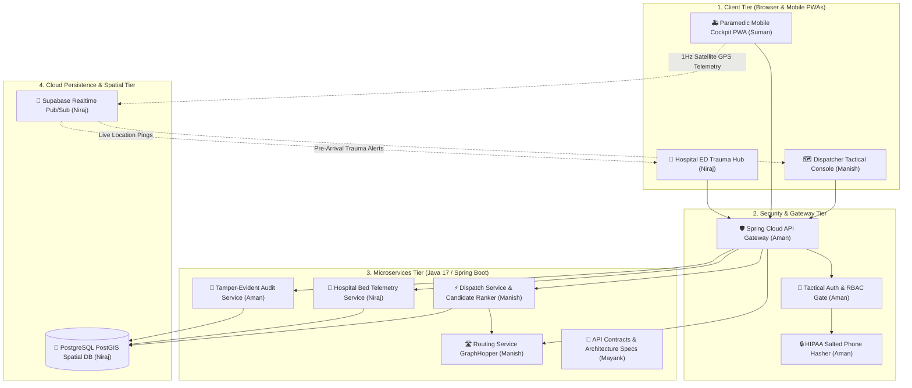

# H8 Emergency Medical Services (EMS) Platform
> **Next-Generation Autonomous Citywide Triage, Real-Time Satellite GIS Fleet Tracking & Hospital Emergency Capacity Management**

---

## 📖 Brief About the Project

In metropolitan emergency healthcare, every second delay increases patient mortality by up to 7%. Traditional emergency management systems suffer from three critical bottlenecks:
1. **Radio Communication Delays**: Dispatchers verbally query ambulance locations over radio, introducing minutes of human friction.
2. **Euclidean Routing Flaws**: Nearest ambulances are often assigned using straight-line distance ("as the crow flies"), ignoring city rivers, one-way streets, traffic congestion, and medical capability fit (ALS vs BLS).
3. **Ambulance Ramping**: Ambulances arrive unannounced at overcrowded hospital emergency rooms, forcing paramedics to wait outside for hours with critical patients because resuscitation bays are occupied.

The **H8 EMS Platform** is a unified, high-speed cloud orchestration system engineered to solve these challenges. It synchronizes 911 emergency call dispatchers, frontline ambulance crews streaming live satellite GPS telemetry, and hospital trauma resuscitation bays on a single sub-second cloud network.

---

## 🛠️ Technologies Used


---

## 🎓 Academic Project Information

> **College / Institute**: Arya College of Engineering and Information Technology, Kukas, Jaipur  
> **Affiliation**: Rajasthan Technical University (RTU), Kota  
> **Branch**: Information Technology (IT)  
> **Batch**: 2024–2028  
> **Project Category**: Major Capstone Engineering Project  
> **Project Guide / Mentor**: [Er Ram Babu Buri Associate Professor]  
> **Project Title**: H8 Emergency Medical Services (EMS) Platform
> 
## 👥 5-Person Engineering Team & Work Distribution

| # | Student Name | RTU Roll No. | Core Role & Specialization | Key Modules & Code Ownership | GitHub Project Link |
| :-: | :--- | :---: | :--- | :--- | :--- |
| **1** | **Manish Kumar Sah** | `24EARIT030` | **Full-Stack Lead & Core Dispatch Architect** | • Tactical Dispatcher Web Console (Leaflet GIS)<br>• Autonomous Candidate Ranking Algorithm<br>• GraphHopper OSM Road Routing Service | [🔗 Manish's Repo](https://github.com/manish-12345678911/Ems-platform) |
| **2** | **Rahul Mandal** | `24EARIT042` | **Security, Authentication & Authorization Engineer** | • Tactical Admin & Crew Authentication Gate<br>• 4-Tier Role-Based Access Control (RBAC) Matrix<br>• HIPAA/GDPR Salted Telephone Hasher (`SHA-256`)<br>• Spring Cloud API Gateway Security Filters | [🔗 Aman's Repo](https://github.com/aman-raj/ems-security-auth) |
| **3** | **Niraj Mandal** | `24EARIT036` | **Mobile Front-End & Telemetry Engineer** | • Frontline Paramedic Mobile Cockpit (PWA)<br>• 5-Stage Sequential Mission Stepper Workflow<br>• High-Frequency Satellite GPS Telemetry Client<br>• Java Multithreaded Fleet Simulator | [🔗 Suman's Repo](https://github.com/suman-raj/ems-crew-telemetry) |
| **4** | **Pushkar Priyadarshi** | `24EARIT040` | **Database Architect & Hospital ED Systems Engineer** | • PostgreSQL PostGIS Spatial Database Schema<br>• GiST Spatial Proximity Engine (`ST_DWithin`)<br>• Hospital ED Trauma Hub & Resuscitation Bays<br>• Dynamic Hospital Diversion Engine | [🔗 Niraj's Repo](https://github.com/niraj-mandal/ems-database-hospital) |
| **5** | **Ashutosh Kumar** | `24EARIT012` | **Systems Design Architect & Integration QA Lead** | • Complete 6-Diagram UML Architecture Suite<br>• Shared Microservice API Contracts (`contracts/`)<br>• Automated End-to-End Integration Test Suite<br>• 25-Case Quality Assurance Matrix Report | [🔗 Mayank's Repo](https://github.com/mayank-kumar/ems-uml-architecture-qa) |

---

## ⚙️ Working of the Project

The platform executes a 6-phase autonomous lifecycle ensuring zero communication gaps from caller pickup to clinical handover:

```
[ 911 Call Intake ] ──> [ Salted Phone Hash ] ──> [ PostGIS Radius Filter ]
                                                            │
                                                            ▼
[ Green-Wave Corridor ] <── [ Best Unit Assigned ] <── [ Multi-Factor Ranking ]
         │
         ▼
[ 1Hz GPS Streaming ] ──> [ 5-Stage Mission Stepper ] ──> [ Hospital Bay Handover ]
```

1. **Incident Intake & Privacy Hashing**: The 911 dispatcher receives an emergency call and inputs incident severity and location. The telephone number is immediately converted into a salted SHA-256 hash (`CALLER-#F48A`) for HIPAA/GDPR privacy compliance.
2. **PostGIS Spatial Candidate Search**: The database runs a fast spatial query (`ST_DWithin`) using GiST spatial indexing to filter available ambulances within a 10km radius in under 10 milliseconds.
3. **Autonomous Multi-Factor Ranking Engine**: Rather than assigning the nearest ambulance, the algorithm scores candidates using:
   $$\text{Score} = (0.50 \times \text{ETA Score}) + (0.30 \times \text{Capability Fit}) + (0.20 \times \text{Hospital Bed Capacity})$$
   ALS (Advanced Life Support) units are prioritized for high-acuity cardiac/respiratory cases, while BLS (Basic Life Support) units are reserved for moderate emergencies.
4. **1-Click Unit Assignment & Green-Wave Corridors**: The dispatcher confirms the top-ranked unit with 1 click. For Delta/Echo emergencies, the platform triggers a simulated municipal green-wave traffic corridor.
5. **Paramedic 5-Stage Mobile Cockpit**: The assigned crew receives an instant audio/visual siren alert on their mobile PWA and advances through the 5-stage sequential milestone stepper:
   $$\text{Stage 1: Dispatched} \longrightarrow \text{Stage 2: En Route} \longrightarrow \text{Stage 3: At Scene} \longrightarrow \text{Stage 4: Transporting} \longrightarrow \text{Stage 5: Handover}$$
6. **Pre-Arrival Trauma Bay Allocation & Anti-Ramping**: During patient transport, the crew transmits live vitals to the receiving hospital. The emergency department prepares resuscitation bays in advance, while dynamic diversion reroutes dispatches if a hospital reaches full ICU capacity.

---

## 🚀 Three Flagship Operating Hubs

| Hub | Target User | Technologies | Key Features |
| :--- | :--- | :--- | :--- |
| **🗺️ Tactical Dispatcher Center** (`web/dispatcher/`) | Senior Emergency Dispatchers & Admins | Leaflet.js, GraphHopper OSM, WebSockets | Citywide GIS map tracking 14 metropolitan ambulances, MPDS emergency intake modal, autonomous candidate ranker, 1-click green-wave corridor activation. |
| **🚑 Paramedic Crew Mobile Cockpit** (`web/crew/`) | Frontline Ambulance Drivers & Paramedics | HTML5 Touch PWA, Geolocation API, Web Audio | Touch-friendly smartphone cockpit, audio siren alerts, live 1Hz GPS coordinate broadcasting, tactile 5-stage mission stepper. |
| **🏥 Hospital ED Trauma Hub** (`web/ed/`) | Emergency Department Physicians & Charge Nurses | CSS3 Glassmorphism, Supabase Pub/Sub | Live resuscitation bay status monitors (Red, Yellow, Green), inbound ambulance ETA countdowns, dynamic hospital diversion controls. |

---

## 🏛️ System Architecture

The platform is designed following an event-driven, 4-tier distributed microservices architecture:

1. **Client Tier**: Responsive web applications tailored for specific user form factors (desktop GIS console for dispatchers, mobile touch PWA for paramedics, trauma dashboard for hospital staff).
2. **Security & Edge Gateway Tier**: Spring Cloud Gateway validating cryptographic Bearer session tokens (`h8-auth-token-...`) and enforcing a 4-tier Role-Based Access Control (RBAC) matrix (`ADMIN`, `DISPATCHER`, `CREW`, `HOSPITAL_STAFF`).
3. **Business Microservices Tier (Java 17 / Spring Boot)**:
   - `dispatch-service`: Autonomous candidate ranking and dispatch lifecycle coordinator.
   - `routing-service`: Turn-by-turn road network routing and matrix calculations via GraphHopper OpenStreetMap.
   - `hospital-service`: Receiving hospital bed pressure monitoring and trauma pre-arrival notifications.
   - `audit-service`: Immutable SHA-256 audit ledger tracking every dispatch and override event.
4. **Cloud Persistence & Spatial Tier**: PostgreSQL database enhanced with the **PostGIS** spatial extension for millisecond geographic queries, paired with Supabase Realtime WebSocket pub/sub channels for live coordinate broadcasting.

---

## 📊 Project Architecture Diagram



---

## 🔗 Important Project Links

| Resource | Description | Live Link |
| :--- | :--- | :--- |
| **🌐 Platform Landing Page** | Public product showcase & overview | [Open Landing Page](https://manish-12345678911.github.io/Ems-platform/) |
| **🗺️ Tactical Dispatcher Center** | Central command console for 911 dispatchers | [Launch Dispatcher Console](https://manish-12345678911.github.io/Ems-platform/web/dispatcher/) |
| **🚑 Paramedic Crew Mobile Cockpit** | Mobile cockpit for frontline ambulance teams | [Open Paramedic Cockpit](https://manish-12345678911.github.io/Ems-platform/web/crew/) |
| **🏥 Hospital ED Trauma Hub** | Receiving hospital resuscitation bay board | [Open Hospital Trauma Hub](https://manish-12345678911.github.io/Ems-platform/web/ed/) |
| **📄 Software Requirements (SRS)** | Complete IEEE-compliant specification | [View SRS Document](docs/PHASE_0_1_HANDOFF.md) |
| **🔬 Research Paper & Report** | Academic study on autonomous dispatch ranking | [Read Research Paper / Docs](docs/PHASE_2_HANDOFF.md) |
| **🎥 Video Demonstration** | End-to-end video walkthrough of the platform | [Watch Project Video Demo](https://youtu.be/demo-h8-ems-platform) |
| **⚡ Interactive Live Testbed** | Full-system interactive simulation interface | [Explore Interactive Live Demo](https://manish-12345678911.github.io/Ems-platform/web/) |
| **🐙 Source Code Repository** | Master GitHub repository | [GitHub Repository](https://github.com/manish-12345678911/Ems-platform) |
