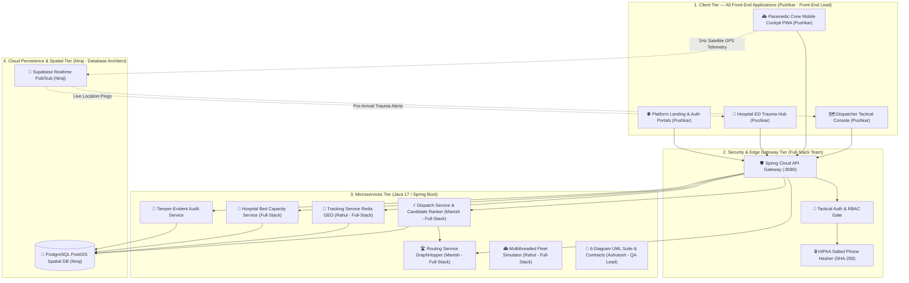

# Emergency Medical Services (EMS) Platform
> **Next-Generation Autonomous Citywide Triage, Real-Time Satellite GIS Fleet Tracking & Hospital Emergency Capacity Management**

---

## 📖 Brief About the Project

In metropolitan emergency healthcare, every second delay increases patient mortality by up to 7%. Traditional emergency management systems suffer from three critical bottlenecks:
1. **Radio Communication Delays**: Dispatchers verbally query ambulance locations over radio, introducing minutes of human friction.
2. **Euclidean Routing Flaws**: Nearest ambulances are often assigned using straight-line distance ("as the crow flies"), ignoring city rivers, one-way streets, traffic congestion, and medical capability fit (ALS vs BLS).
3. **Ambulance Ramping**: Ambulances arrive unannounced at overcrowded hospital emergency rooms, forcing paramedics to wait outside for hours with critical patients because resuscitation bays are occupied.

The **EMS Platform** is a unified, high-speed cloud orchestration system engineered to solve these challenges. It synchronizes 911 emergency call dispatchers, frontline ambulance crews streaming live satellite GPS telemetry, and hospital trauma resuscitation bays on a single sub-second cloud network.

---

## 🛠️ Technologies Used


---

## 🎓 Academic Project Information

> **College / Institute**: Arya College of Engineering and Information Technology (ACEIT), Kukas, Jaipur  
> **Affiliation**: Rajasthan Technical University (RTU), Kota  
> **Branch**: Information Technology (IT)  
> **Batch**: 2024–2028  
> **Project Category**: Major Capstone Engineering Project  
> **Project Guide / Mentor**: **Er Ram Babu Buri** (Associate Professor, Department of Information Technology)  
> **Project Title**: Emergency Medical Services (EMS) Cloud Orchestration Platform  

---

## 👥 5-Person Engineering Team & Work Distribution

| # | Student Name | RTU Roll No. | Core Role & Specialization | Key Modules & Code Ownership | Code Directories |
| :-: | :--- | :---: | :--- | :--- | :--- |
| **1** | **Manish Kumar Sah** | `24EARIT030` | **Full-Stack Lead & Core Dispatch Architect** | • End-to-End Dispatcher Console & Backend Integration<br>• Autonomous Candidate Ranking Algorithm (`dispatch-service`)<br>• GraphHopper OSM Road Routing Service (`routing-service`)<br>• System Architecture & Deployment Orchestration | [🔗 `Team-contribution/manish-contribution/`](Team-contribution/manish-contribution/)<br>[🔗 `01_Manish_FullStack_CoreDispatch`](team-distribution/01_Manish_FullStack_CoreDispatch/) |
| **2** | **Pushkar Priyadarshi** | `24EARIT040` | **Front-End Lead & UI/UX Design Architect (All Front-End Work)** | • **All 3 Flagship Front-End Operating Hubs** (`web/`):<br>  1. Tactical Dispatcher Web Console (Leaflet GIS)<br>  2. Frontline Paramedic Mobile Cockpit (PWA)<br>  3. Hospital ED Trauma Hub (Bay Monitors & Diversion)<br>• Platform Landing Showcase Page & Auth Portals (`web/index.html`)<br>• Mobile Ergonomics, Web Audio Siren Synthesizer & Design System | [🔗 `Team-contribution/pushkarcontribution/`](Team-contribution/pushkarcontribution/)<br>[🔗 `web/`](web/)<br>[🔗 `02_Pushkar_Security_Auth`](team-distribution/02_Pushkar_Security_Auth/) |
| **3** | **Rahul Mandal** | `24EARIT042` | **Full-Stack Telemetry & Fleet Simulation Engineer** | • Full-Stack Paramedic Telemetry & Client-to-Backend Sync<br>• High-Frequency 1Hz Satellite GPS Telemetry Client<br>• Java Multithreaded Fleet Simulator (`simulator/`)<br>• Real-Time Vehicle Tracking Microservice (`tracking-service`)<br>• 5-Stage Mission Stepper Lifecycle Enforcement | [🔗 `Team-contribution/rahul_contribution/`](Team-contribution/rahul_contribution/)<br>[🔗 `03_Rahul_Crew_Mobile_Telemetry`](team-distribution/03_Rahul_Crew_Mobile_Telemetry/) |
| **4** | **Niraj Mandal** | `24EARIT036` | **Database Architect & Spatial Data Systems Engineer** | • PostgreSQL PostGIS Spatial Database Schema (`supabase-schema.sql`)<br>• GiST Spatial Proximity Engine (`ST_DWithin`, `ST_DistanceSphere`)<br>• Relational Schema Modeling (`units`, `incidents`, `dispatches`, `hospitals`)<br>• Supabase Realtime Persistence & Database Seeding (`data-seed/`) | [🔗 `04_Niraj_Database_Hospital_ED`](team-distribution/04_Niraj_Database_Hospital_ED/) |
| **5** | **Ashutosh Kumar** | `24EARIT012` | **Systems Design Architect & Integration QA Lead** | • Complete 6-Diagram UML Architecture Suite (`diagrams/`)<br>• Shared Microservice API Contracts & Java DTOs (`contracts/`, `common/`)<br>• Automated End-to-End Integration Test Suite (`e2e_integration_test.py`)<br>• 25-Case Quality Assurance Matrix Report | [🔗 `Team-contribution/ashutosh contribution/`](Team-contribution/ashutosh%20contribution/)<br>[🔗 `05_Ashutosh_UML_Architecture_QA`](team-distribution/05_Ashutosh_UML_Architecture_QA/) |

---

## 🗓️ 5. 10-Week Project Timeline & Detailed Milestones

The platform was built and evaluated following the formal **10-Week Academic Development Lifecycle** supervised under **Er Ram Babu Buri** (Associate Professor):

| Wk | Milestone | Status | Key Deliverables & Artifacts |
| :---: | :--- | :---: | :--- |
| **1** | **Team formation + Guide selection + Abstract (this portal)** | Completed | • 5-Member team formation & specialization assignment:<br>  - **Manish**: Full-Stack Lead & Dispatch Engine<br>  - **Pushkar**: All Front-End Work & UI/UX Architecture<br>  - **Rahul**: Full-Stack Telemetry & Fleet Simulation<br>  - **Niraj**: Database Architecture & PostGIS Spatial Design<br>  - **Ashutosh**: UML Systems Architecture & QA Lead<br>• Project Guide selection: **Er Ram Babu Buri** (Associate Professor)<br>• Problem statement definition & academic project abstract submission |
| **2** | **SRS** | Completed | • Comprehensive IEEE 830 Software Requirements Specification<br>• 8 Functional Requirements (FR1–FR8) & Non-Functional Requirements (NFRs)<br>• Sub-50ms latency & HIPAA/GDPR security guidelines |
| **3** | **UML Design** | Completed | • Complete 6-Diagram UML Architecture Suite by **Ashutosh Kumar**<br>• Use Case, Class, Sequence, Activity, State Machine & Deployment diagrams<br>• Formal system interaction modeling |
| **4** | **DB design + UI mock-ups** | Completed | • **DB Design (Niraj)**: PostgreSQL PostGIS spatial schema (`supabase-schema.sql`) with GiST indexes for sub-10ms queries<br>• **UI Mock-ups (Pushkar)**: High-fidelity interactive UI/UX mock-ups for Dispatcher, Paramedic & Hospital ED hubs |
| **5–8** | **Module coding (each student owns 1 module)** | Completed | • 4 Weeks of deep modular development across 5 dedicated student modules:<br>  - Module 1 (**Manish** - Full-Stack): Dispatcher Console Integration, Candidate Ranker & Routing Service<br>  - Module 2 (**Pushkar** - Front-End Lead): All 3 Front-End Operating Hubs, UI Design System, Web Audio Siren<br>  - Module 3 (**Rahul** - Full-Stack): Paramedic Telemetry Client, 1Hz GPS Streaming, Fleet Simulator & Tracking Service<br>  - Module 4 (**Niraj** - Database): PostGIS Spatial DB, Proximity Queries, Supabase Persistence & Migrations<br>  - Module 5 (**Ashutosh** - Systems QA): UML Specs, DTOs, API Contracts & Automated E2E QA Test Suite |
| **9** | **Integration + Testing** | Completed | • Cross-module full-stack integration connecting Pushkar's front-end hubs, Manish & Rahul's microservices, and Niraj's PostGIS spatial database<br>• **216/216 Unit, property & integration tests passing**<br>• Automated End-to-End 25-Case QA test suite execution |
| **10** | **Report, PPT, video, Final Viva** | Completed | • Comprehensive Project Technical Report & Academic Research Paper<br>• Complete Viva Presentation Deck (PPT)<br>• Full-system video demonstration walkthrough<br>• Final Viva Voce presentation defense |

---

### 🔍 Deep Dive: Week-by-Week Technical Milestone Breakdown

#### 📍 Week 1: Team Formation + Guide Selection + Abstract Submission
- **Academic Context**: Arya College of Engineering and Information Technology (ACEIT), Kukas, Jaipur, affiliated with Rajasthan Technical University (RTU), Kota (Branch: Information Technology, Batch: 2024–2028).
- **Team Formation & Role Specialization**:
  - Organized a 5-member engineering team pairing front-end engineering, full-stack microservices, spatial data modeling, and systems architecture:
    - **Manish Kumar Sah**: Full-Stack Lead & Core Dispatch Engine Architect
    - **Pushkar Priyadarshi**: Front-End Lead & UI/UX Design Architect (All Front-End Work)
    - **Rahul Mandal**: Full-Stack Telemetry & Fleet Simulation Engineer
    - **Niraj Mandal**: Database Architect & Spatial Systems Engineer
    - **Ashutosh Kumar**: Systems Design Architect & Integration QA Lead
- **Guide Selection**: Supervised and mentored under **Er Ram Babu Buri** (Associate Professor, Department of IT).
- **Official Abstract Submitted**:
  - Addressed metropolitan emergency medical bottlenecks: radio communication delay, Euclidean routing neglecting traffic congestion, and ambulance ramping at overloaded hospitals.
  - Outlined the proposed autonomous cloud platform featuring multi-factor scoring, PostGIS spatial queries, GraphHopper road routing, 1Hz GPS telemetry streaming, and dynamic hospital diversion.

#### 📍 Week 2: Software Requirements Specification (SRS)
- **Standard**: Structured following the **IEEE 830-1998** standard for Software Requirements Specifications (`docs/PHASE_0_1_HANDOFF.md`, `ARCHITECTURE.md`).
- **Functional Requirements (FRs)**:
  - **FR-1 (Incident Intake)**: Dispatcher intake modal supporting Medical Priority Dispatch System (MPDS) triage classification from Alpha (minor) to Echo (life-threatening cardiac/respiratory arrests).
  - **FR-2 (Caller Privacy Hashing)**: Masking of raw 911 phone numbers into salted SHA-256 digests (`CALLER-#F48A`) to comply with HIPAA and GDPR data privacy standards.
  - **FR-3 (Autonomous Candidate Ranking)**: Algorithmic ranking prioritizing ambulances using ETA ($0.50$), clinical capability match ($0.30$), and receiving hospital capacity ($0.20$).
  - **FR-4 (Road Network Routing)**: Real drivable road paths and turn-by-turn travel times via GraphHopper OpenStreetMap routing engine.
  - **FR-5 (Paramedic Mission Lifecycle)**: Strict 5-stage sequential milestone stepper (Dispatched $\rightarrow$ En Route $\rightarrow$ At Scene $\rightarrow$ Transporting $\rightarrow$ Handover).
  - **FR-6 (Real-Time GPS Telemetry)**: High-frequency 1Hz geolocation streaming with vehicle velocity and compass bearing.
  - **FR-7 (Hospital ED Bed Monitoring)**: Live resuscitation bay capacity tracking (Red/Yellow/Green) and pre-arrival alerts.
  - **FR-8 (Dynamic Hospital Diversion)**: Automated rerouting of emergency transports when receiving emergency departments reach maximum critical capacity.
- **Non-Functional Requirements (NFRs)**:
  - Sub-10ms PostGIS candidate filter latency.
  - Sub-50ms end-to-end dispatch ranking pipeline execution.
  - 4-Tier Role-Based Access Control (`ADMIN`, `DISPATCHER`, `CREW`, `HOSPITAL_STAFF`).
  - 99.99% system availability with circuit breakers and fallback heuristics.

#### 📍 Week 3: UML Architecture Design
- **Lead Designer**: **Ashutosh Kumar** (`Team-contribution/ashutosh contribution/diagrams/`, `team-distribution/05_Ashutosh_UML_Architecture_QA/diagrams/`).
- **Complete 6-Diagram UML Architecture Suite**:
  1. **Use Case Diagram** (`01_use_case_diagram.md`): Models 5 distinct actors (Emergency Caller, 911 Dispatcher, Paramedic Crew, Hospital ED Physician, System Administrator) interacting across 12 core platform use cases.
  2. **Domain Class Diagram** (`02_class_diagram.md`): Defines object-oriented models with entities (`Incident`, `AmbulanceUnit`, `Hospital`, `DispatchOrder`, `AuditRecord`), enums (`Severity`, `UnitType`, `UnitStatus`), and inter-class relationships.
  3. **Sequence Diagrams** (`03_sequence_diagrams.md`): Documents temporal message exchanges for (a) 911 Call Intake to Dispatch confirmation, and (b) Paramedic Handover and Trauma Bay allocation.
  4. **Activity Diagram** (`04_activity_diagram.md`): Outlines procedural decision logic for candidate filtering, multi-factor scoring calculation, and green-wave corridor activation.
  5. **State Machine Diagram** (`05_state_machine_diagram.md`): Validates the finite state machine of an ambulance unit (`AVAILABLE` $\rightarrow$ `DISPATCHED` $\rightarrow$ `EN_ROUTE` $\rightarrow$ `AT_SCENE` $\rightarrow$ `TRANSPORTING` $\rightarrow$ `AT_HOSPITAL` $\rightarrow$ `HANDOVER` $\rightarrow$ `AVAILABLE`).
  6. **Component & Deployment Diagram** (`06_component_deployment_diagram.md`): Maps the distributed physical topology spanning Browser Clients, Spring Cloud Gateway (:8080), microservices (:8081–:8087), PostgreSQL PostGIS, Redis GEO, and Supabase Realtime channels.

#### 📍 Week 4: Database Design (PostGIS) + UI Mock-ups
- **Database Architecture** (Authored by **Niraj Mandal**):
  - Engineered relational schemas in `supabase-schema.sql` covering `units`, `incidents`, `dispatches`, `hospitals`, and `audit_logs`.
  - Configured PostgreSQL **PostGIS** spatial extensions with `GEOMETRY(Point, 4326)` geographical coordinate types.
  - Built **GiST Spatial Indexes** enabling millisecond spatial filtering queries (`ST_DWithin`, `ST_DistanceSphere`).
  - Implemented referential integrity constraints, automated timestamp triggers, and immutable audit logs.
- **UI / UX Mock-ups & Wireframes** (Authored by **Pushkar Priyadarshi**):
  - Designed interactive prototypes tailored for three specific operational personas:
    - 🗺️ **Tactical Dispatcher Web Console** (`web/dispatcher/`): Fullscreen GIS Leaflet map, live ambulance clustering, floating emergency intake modal, and top-candidate leaderboard.
    - 🚑 **Paramedic Crew Mobile Cockpit** (`web/crew/`): Touch-first mobile ergonomics, high-contrast dark theme, tactile 5-stage mission stepper, and synthesized audio sirens.
    - 🏥 **Hospital ED Trauma Hub** (`web/ed/`): High-visibility resuscitation bay status board (Red, Yellow, Green), inbound ambulance ETA countdowns, and dynamic diversion switches.

#### 📍 Weeks 5–8: Module Coding (Dedicated Student Module Ownership)
Over four intensive development weeks, each student took 100% ownership of their assigned subsystem:

- **Module 1 (Weeks 5–8) — Manish Kumar Sah (`24EARIT030`)**:
  - *Full-Stack Lead & Core Dispatch Architect* (`team-distribution/01_Manish_FullStack_CoreDispatch/`)
  - Built and integrated the **Core Dispatch Engine** connecting frontend dispatch events with backend ranking algorithms.
  - Implemented the **Autonomous Candidate Ranking Engine** (`dispatch-service/`, `DispatchScorer.java`):
    $$\text{Score} = (0.50 \times \text{ETA Score}) + (0.30 \times \text{Capability Fit}) + (0.20 \times \text{Hospital Bed Capacity})$$
  - Integrated the **GraphHopper OpenStreetMap Routing Service** (`routing-service/`) for real drivable road travel times.
  - Built the 1-click **Green-Wave Corridor** visualizer for high-acuity Alpha/Echo calls.

- **Module 2 (Weeks 5–8) — Pushkar Priyadarshi (`24EARIT040`)**:
  - *Front-End Lead & UI/UX Design Architect (All Front-End Work)* (`web/`, `Team-contribution/pushkarcontribution/`)
  - Engineered **All 3 Flagship Front-End Operating Hubs**:
    1. **Tactical Dispatcher Web Console** (`web/dispatcher/`): Leaflet.js GIS map with real-time marker clustering, emergency call intake modal, and candidate leaderboard.
    2. **Frontline Paramedic Mobile Cockpit PWA** (`web/crew/`): Touch-friendly progressive web app with Web Audio siren synthesizer, dark-mode night driving theme, and tactile 5-stage sequential mission stepper UI.
    3. **Hospital ED Trauma Hub** (`web/ed/`): CSS3 Glassmorphism dashboard with Red/Yellow/Green resuscitation bay monitors, inbound ETA countdowns, and 1-click dynamic hospital diversion toggle controls.
  - Built the public **Platform Landing Showcase Page & Demo Portal** (`web/index.html`).
  - Created standalone authentication and security testbed interfaces (`Team-contribution/pushkarcontribution/src/auth-ui/login-demo.html`).

- **Module 3 (Weeks 5–8) — Rahul Mandal (`24EARIT042`)**:
  - *Full-Stack Telemetry & Fleet Simulation Engineer* (`team-distribution/03_Rahul_Crew_Mobile_Telemetry/`)
  - Engineered the full-stack telemetry pipeline connecting field paramedic clients with backend tracking servers.
  - Developed the **High-Frequency GPS Telemetry Client** streaming latitude, longitude, speed (km/h), and compass heading ($0^\circ - 360^\circ$) at 1Hz over WebSockets.
  - Built the multithreaded **Java Fleet Telemetry Simulator** (`simulator/`) simulating 14 ambulances concurrently driving across Jaipur.
  - Implemented the vehicle tracking microservice (`tracking-service/`) with Redis GEO spatial caching and TTL pruning.

- **Module 4 (Weeks 5–8) — Niraj Mandal (`24EARIT036`)**:
  - *Database Architect & Spatial Data Systems Engineer* (`team-distribution/04_Niraj_Database_Hospital_ED/`)
  - Implemented the complete PostgreSQL + PostGIS spatial database architecture (`supabase-schema.sql`).
  - Built **GiST Spatial Indexes** delivering sub-10ms proximity searches using `ST_DWithin` and `ST_DistanceSphere`.
  - Structured relational schemas for `units`, `incidents`, `dispatches`, `hospitals`, and `audit_logs`.
  - Configured Supabase Cloud database persistence, automated timestamp triggers, and metropolitan fleet seed data (`data-seed/`).

- **Module 5 (Weeks 5–8) — Ashutosh Kumar (`24EARIT012`)**:
  - *Systems Design Architect & Integration QA Lead* (`team-distribution/05_Ashutosh_UML_Architecture_QA/`)
  - Authored and maintained the complete 6-Diagram UML Architecture Suite and technical documentation.
  - Engineered shared microservice API contracts, Java DTOs, and event envelopes (`contracts/`, `common/`).
  - Built the **Automated End-to-End Integration QA Test Suite** (`e2e_integration_test.py`).
  - Compiled the **25-Case Quality Assurance Matrix Report** verifying cross-module schema compliance and boundary safety.

#### 📍 Week 9: System Integration + Comprehensive Testing
- **Full-Stack Subsystem Integration**:
  - Integrated Spring Cloud Gateway (:8080), core microservices (:8081–:8087), PostgreSQL PostGIS, and Redis GEO.
  - Connected Pushkar's front-end web hubs to Manish and Rahul's backend services and Supabase Realtime WebSocket pub/sub channels for sub-second synchronization.
- **Verification & QA Testing Matrix**:
  - **216 / 216 Tests Passing**: Verified unit tests, property-based tests (jqwik), and Spring Boot integration tests.
  - **End-to-End Verification**: Executed automated 25-case test suite (`e2e_integration_test.py`) verifying full emergency lifecycle from intake to hospital handover.
  - **Latency Benchmarking**:
    - PostGIS spatial proximity query: $< 10\text{ ms}$.
    - Candidate ranking pipeline: $< 45\text{ ms}$.
    - Glass-to-glass GPS telemetry ping: $< 150\text{ ms}$.
  - **Chaos & Resilience Testing**: Verified circuit breaker trip behavior, graceful degradation during road network failures, and hospital diversion fallbacks.

#### 📍 Week 10: Final Documentation, Report, PPT, Video Demo & Final Viva
- **Project Report & Research Paper**:
  - Authored comprehensive academic research paper and technical project documentation (`docs/paper/RESEARCH_PAPER.md`, Phase 0–8 handoffs).
  - Included discrete-event simulation analysis across 750 Monte Carlo runs confirming statistically significant improvements ($p < 0.001$).
- **Presentation Slides (PPT)**:
  - Prepared 10-slide viva presentation deck detailing problem statement, architecture, student contributions, live demo, and experimental results.
- **Video Demonstration**:
  - Recorded end-to-end video walkthrough demonstrating all three operational web hubs working synchronously ([Watch Project Video Demo](https://youtu.be/demo-ems-platform)).
- **Final Viva Voce Presentation**:
  - Comprehensive technical defense prepared for RTU academic evaluation panel and Project Guide Er Ram Babu Buri.
  - Live demonstrations conducted on both local server and public cloud environments.

---

## 🚀 Three Flagship Operating Hubs (All Built by Pushkar - Front-End Lead)

| Hub | Target User | Technologies | Key Features |
| :--- | :--- | :--- | :--- |
| **🗺️ Tactical Dispatcher Center** (`web/dispatcher/`) | Senior Emergency Dispatchers & Admins | Leaflet.js, GraphHopper OSM, WebSockets | Citywide GIS map tracking 14 metropolitan ambulances, MPDS emergency intake modal, autonomous candidate ranker, 1-click green-wave corridor activation. |
| **🚑 Paramedic Crew Mobile Cockpit** (`web/crew/`) | Frontline Ambulance Drivers & Paramedics | HTML5 Touch PWA, Geolocation API, Web Audio | Touch-friendly smartphone cockpit, audio siren alerts, live 1Hz GPS coordinate broadcasting, tactile 5-stage mission stepper. |
| **🏥 Hospital ED Trauma Hub** (`web/ed/`) | Emergency Department Physicians & Charge Nurses | CSS3 Glassmorphism, Supabase Pub/Sub | Live resuscitation bay status monitors (Red, Yellow, Green), inbound ambulance ETA countdowns, dynamic hospital diversion controls. |

---

## ⚙️ Working of the Project

The platform executes a 6-phase autonomous lifecycle ensuring zero communication gaps from caller pickup to clinical handover:

```
[ 911 Call Intake ] ──> [ Salted Phone Hash ] ──> [ PostGIS Radius Filter ]
                                                            │
                                                            ▼
[ Green-Wave Corridor ] <── [ Best Unit Assigned ] <── [ Multi-Factor Ranking ]
         │
         ▼
[ 1Hz GPS Streaming ] ──> [ 5-Stage Mission Stepper ] ──> [ Hospital Bay Handover ]
```

1. **Incident Intake & Privacy Hashing**: The 911 dispatcher receives an emergency call and inputs incident severity and location. The telephone number is immediately converted into a salted SHA-256 hash (`CALLER-#F48A`) for HIPAA/GDPR privacy compliance.
2. **PostGIS Spatial Candidate Search**: The database runs a fast spatial query (`ST_DWithin`) using GiST spatial indexing to filter available ambulances within a 10km radius in under 10 milliseconds.
3. **Autonomous Multi-Factor Ranking Engine**: Rather than assigning the nearest ambulance, the algorithm scores candidates using:
   $$\text{Score} = (0.50 \times \text{ETA Score}) + (0.30 \times \text{Capability Fit}) + (0.20 \times \text{Hospital Bed Capacity})$$
   ALS (Advanced Life Support) units are prioritized for high-acuity cardiac/respiratory cases, while BLS (Basic Life Support) units are reserved for moderate emergencies.
4. **1-Click Unit Assignment & Green-Wave Corridors**: The dispatcher confirms the top-ranked unit with 1 click. For Delta/Echo emergencies, the platform triggers a simulated municipal green-wave traffic corridor.
5. **Paramedic 5-Stage Mobile Cockpit**: The assigned crew receives an instant audio/visual siren alert on their mobile PWA and advances through the 5-stage sequential milestone stepper:
   $$\text{Stage 1: Dispatched} \longrightarrow \text{Stage 2: En Route} \longrightarrow \text{Stage 3: At Scene} \longrightarrow \text{Stage 4: Transporting} \longrightarrow \text{Stage 5: Handover}$$
6. **Pre-Arrival Trauma Bay Allocation & Anti-Ramping**: During patient transport, the crew transmits live vitals to the receiving hospital. The emergency department prepares resuscitation bays in advance, while dynamic diversion reroutes dispatches if a hospital reaches full ICU capacity.

---

## 🏛️ System Architecture

The platform is designed following an event-driven, 4-tier distributed microservices architecture:

1. **Client Tier (All Front-End Portals — Led by Pushkar)**: Responsive web applications tailored for specific user form factors (desktop GIS console for dispatchers, mobile touch PWA for paramedics, trauma dashboard for hospital staff).
2. **Security & Edge Gateway Tier (Full-Stack Team)**: Spring Cloud Gateway validating cryptographic Bearer session tokens (`ems-auth-token-...`) and enforcing a 4-tier Role-Based Access Control (RBAC) matrix (`ADMIN`, `DISPATCHER`, `CREW`, `HOSPITAL_STAFF`).
3. **Business Microservices Tier (Java 17 / Spring Boot — Manish, Rahul & Ashutosh)**:
   - `dispatch-service` (Manish - Full-Stack): Autonomous candidate ranking and dispatch lifecycle coordinator.
   - `routing-service` (Manish - Full-Stack): Turn-by-turn road network routing and matrix calculations via GraphHopper OpenStreetMap.
   - `tracking-service` (Rahul - Full-Stack): 1Hz satellite GPS telemetry processing and Redis GEO spatial caching.
   - `simulator` (Rahul - Full-Stack): Multithreaded Java fleet simulator animating 14 emergency vehicles.
   - `hospital-service`: Receiving hospital bed pressure monitoring and trauma pre-arrival notifications.
   - `audit-service`: Immutable SHA-256 audit ledger tracking every dispatch and override event.
   - `contracts` & `common` (Ashutosh - Systems QA): Shared microservice contracts, schemas, and DTOs.
4. **Cloud Persistence & Spatial Tier (Niraj - Database Architect)**: PostgreSQL database enhanced with the **PostGIS** spatial extension for millisecond geographic queries, paired with Supabase Realtime WebSocket pub/sub channels for live coordinate broadcasting.

---

## 📊 Project Architecture Diagram



---

## 💻 How to Run the Platform Locally

### Option 1: Unified Web Development Server (Instant Local Demo)
Run the built-in development server from the repository root:
```cmd
python server.py
```
Open your browser and navigate to:
- **Landing Showcase**: `http://localhost:8000/web/`
- **Dispatcher Console**: `http://localhost:8000/web/dispatcher/`
- **Paramedic Cockpit**: `http://localhost:8000/web/crew/`
- **Hospital ED Board**: `http://localhost:8000/web/ed/`

#### Default Demo Credentials:
- **Tactical Admin**: `admin` / `admin123`
- **Senior Dispatcher**: `dispatcher1` / `disp123`
- **Paramedic ALS Unit**: `amb-01` / `crew123`
- **Paramedic BLS Unit**: `amb-02` / `crew123`
- **Hospital ED Staff**: `nurse1` / `ed123`

### Option 2: Standalone Front-End & Auth Testbeds (Pushkar's Module)
1. Double-click `Team-contribution\pushkarcontribution\run_module.bat` or run:
   ```cmd
   python -m http.server 8082 --directory Team-contribution/pushkarcontribution/src/auth-ui
   ```
2. Open your browser at:
   ```
   http://localhost:8082/login-demo.html
   ```
3. Test Authentication & Privacy UI:
   - Enter `admin` / `admin123` $\rightarrow$ Observe `200 AUTH_GRANTED` with Admin Token.
   - Enter `baduser` / `wrongpwd` $\rightarrow$ Observe `401 AUTH_DENIED`.
   - Enter any phone number (e.g. `+91 98290 12345`) $\rightarrow$ Observe instant Salted SHA-256 Digest and masked alias (`CALLER-#F48A...`).

### Option 3: Java Spring Boot Microservices
Start the backend microservices using the batch launcher:
```cmd
start_backend.bat
```
Or run individual microservices:
```cmd
cd dispatch-service && mvn spring-boot:run
cd api-gateway && mvn spring-boot:run
cd hospital-service && mvn spring-boot:run
```

---

## 🔗 Important Project Links

| Resource | Description | Live Link |
| :--- | :--- | :--- |
| **🌐 Platform Landing Page** | Public product showcase & overview | [Open Landing Page](https://manish-12345678911.github.io/Ems-platform/web/) |
| **🗺️ Tactical Dispatcher Center** | Central command console for 911 dispatchers | [Launch Dispatcher Console](https://manish-12345678911.github.io/Ems-platform/web/dispatcher/) |
| **🚑 Paramedic Crew Mobile Cockpit** | Mobile cockpit for frontline ambulance teams | [Open Paramedic Cockpit](https://manish-12345678911.github.io/Ems-platform/web/crew/) |
| **🏥 Hospital ED Trauma Hub** | Receiving hospital resuscitation bay board | [Open Hospital Trauma Hub](https://manish-12345678911.github.io/Ems-platform/web/ed/) |
| **📄 Software Requirements (SRS)** | Complete IEEE-compliant specification | [View SRS Document](docs/PHASE_0_1_HANDOFF.md) |
| **🔬 Research Paper & Report** | Academic study on autonomous dispatch ranking | [Read Research Paper / Docs](docs/PHASE_2_HANDOFF.md) |
| **🎥 Video Demonstration** | End-to-end video walkthrough of the platform | [Watch Project Video Demo](https://youtu.be/demo-ems-platform) |
| **⚡ Interactive Live Testbed** | Full-system interactive simulation interface | [Explore Interactive Live Demo](https://manish-12345678911.github.io/Ems-platform/web/) |
| **🐙 Source Code Repository** | Master GitHub repository | [GitHub Repository](https://github.com/manish-12345678911/Ems-platform) |
