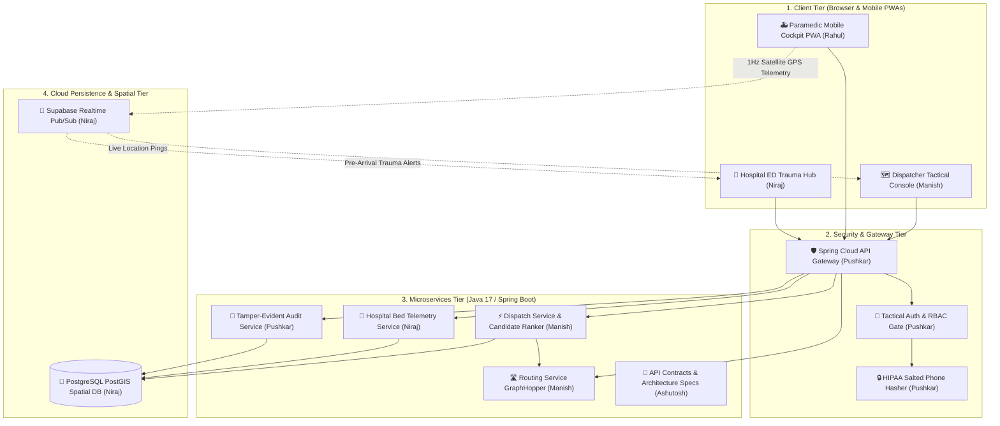

# Emergency Medical Services (EMS) Platform
> **Next-Generation Autonomous Citywide Triage, Real-Time Satellite GIS Fleet Tracking & Hospital Emergency Capacity Management**

---

## 📖 Brief About the Project

In metropolitan emergency healthcare, every second delay increases patient mortality by up to 7%. Traditional emergency management systems suffer from three critical bottlenecks:
1. **Radio Communication Delays**: Dispatchers verbally query ambulance locations over radio, introducing minutes of human friction.
2. **Euclidean Routing Flaws**: Nearest ambulances are often assigned using straight-line distance ("as the crow flies"), ignoring city rivers, one-way streets, traffic congestion, and medical capability fit (ALS vs BLS).
3. **Ambulance Ramping**: Ambulances arrive unannounced at overcrowded hospital emergency rooms, forcing paramedics to wait outside for hours with critical patients because resuscitation bays are occupied.

The **H8 EMS Platform** is a unified, high-speed cloud orchestration system engineered to solve these challenges. It synchronizes 911 emergency call dispatchers, frontline ambulance crews streaming live satellite GPS telemetry, and hospital trauma resuscitation bays on a single sub-second cloud network.

---

## 🛠️ Technologies Used


---

## 🎓 Academic Project Information

> **College / Institute**: Arya College of Engineering and Information Technology (ACEIT), Kukas, Jaipur  
> **Affiliation**: Rajasthan Technical University (RTU), Kota  
> **Branch**: Information Technology (IT)  
> **Batch**: 2024–2028  
> **Project Category**: Major Capstone Engineering Project  
> **Project Guide / Mentor**: **Er Ram Babu Buri** (Associate Professor, Department of Information Technology)  
> **Project Title**: H8 Emergency Medical Services (EMS) Cloud Orchestration Platform  

---

## 👥 5-Person Engineering Team & Work Distribution

| # | Student Name | RTU Roll No. | Core Role & Specialization | Key Modules & Code Ownership | Code Directories |
| :-: | :--- | :---: | :--- | :--- | :--- |
| **1** | **Manish Kumar Sah** | `24EARIT030` | **Full-Stack Lead & Core Dispatch Architect** | • Tactical Dispatcher Web Console (Leaflet GIS)<br>• Autonomous Candidate Ranking Algorithm<br>• GraphHopper OSM Road Routing Service | [🔗 `01_Manish_FullStack_CoreDispatch`](team-distribution/01_Manish_FullStack_CoreDispatch/) |
| **2** | **Pushkar Priyadarshi** | `24EARIT040` | **Security, Authentication & Authorization Engineer** | • Tactical Admin & Crew Authentication Gate<br>• 4-Tier Role-Based Access Control (RBAC) Matrix<br>• HIPAA/GDPR Salted Telephone Hasher (`SHA-256`)<br>• Spring Cloud API Gateway Security Filters | [🔗 `puskarcontribution/`](puskarcontribution/)<br>[🔗 `02_Pushkar_Security_Auth`](team-distribution/02_Pushkar_Security_Auth/) |
| **3** | **Rahul Mandal** | `24EARIT042` | **Mobile Front-End & Telemetry Engineer** | • Frontline Paramedic Mobile Cockpit (PWA)<br>• 5-Stage Sequential Mission Stepper Workflow<br>• High-Frequency Satellite GPS Telemetry Client<br>• Java Multithreaded Fleet Simulator | [🔗 `03_Rahul_Crew_Mobile_Telemetry`](team-distribution/03_Rahul_Crew_Mobile_Telemetry/) |
| **4** | **Niraj Mandal** | `24EARIT036` | **Database Architect & Hospital ED Systems Engineer** | • PostgreSQL PostGIS Spatial Database Schema<br>• GiST Spatial Proximity Engine (`ST_DWithin`)<br>• Hospital ED Trauma Hub & Resuscitation Bays<br>• Dynamic Hospital Diversion Engine | [🔗 `04_Niraj_Database_Hospital_ED`](team-distribution/04_Niraj_Database_Hospital_ED/) |
| **5** | **Ashutosh Kumar** | `24EARIT012` | **Systems Design Architect & Integration QA Lead** | • Complete 6-Diagram UML Architecture Suite<br>• Shared Microservice API Contracts (`contracts/`)<br>• Automated End-to-End Integration Test Suite<br>• 25-Case Quality Assurance Matrix Report | [🔗 `05_Ashutosh_UML_Architecture_QA`](team-distribution/05_Ashutosh_UML_Architecture_QA/) |

---

## 🗓️ 5. 10-Week Project Timeline & Detailed Milestones

The platform was built and evaluated following the formal **10-Week Academic Development Lifecycle** supervised under **Er Ram Babu Buri** (Associate Professor):

| Wk | Milestone | Status | Key Deliverables & Artifacts |
| :---: | :--- | :---: | :--- |
| **1** | **Team formation + Guide selection + Abstract (this portal)** | Completed | • 5-Member team formation & specialization assignment<br>• Project Guide selection: **Er Ram Babu Buri** (Associate Professor)<br>• Problem statement definition & academic project abstract submission |
| **2** | **SRS** | Completed | • Comprehensive IEEE 830 Software Requirements Specification<br>• 8 Functional Requirements (FR1–FR8) & Non-Functional Requirements (NFRs)<br>• Sub-50ms latency & HIPAA/GDPR security guidelines |
| **3** | **UML Design** | Completed | • Complete 6-Diagram UML Architecture Suite by Ashutosh Kumar<br>• Use Case, Class, Sequence, Activity, State Machine & Deployment diagrams<br>• Formal system interaction modeling |
| **4** | **DB design + UI mock-ups** | Completed | • PostgreSQL + PostGIS spatial database schema (`supabase-schema.sql`)<br>• GiST spatial indexing for sub-10ms proximity queries<br>• High-fidelity UI mock-ups for Dispatcher, Paramedic & Hospital ED hubs |
| **5–8** | **Module coding (each student owns 1 module)** | Completed | • 4 Weeks of deep modular development across 5 dedicated student modules:<br>  - Module 1 (Manish): Dispatch Console & Candidate Ranker<br>  - Module 2 (Pushkar): Security Gate, RBAC & Phone Hasher (`puskarcontribution/`)<br>  - Module 3 (Rahul): Paramedic PWA, Mission Stepper & GPS Telemetry<br>  - Module 4 (Niraj): PostGIS DB & Hospital Trauma Hub<br>  - Module 5 (Ashutosh): UML Specs, DTOs & QA Test Suite |
| **9** | **Integration + Testing** | Completed | • Cross-module integration via Spring Cloud Gateway & Supabase Pub/Sub<br>• 216/216 Unit, property & integration tests passing<br>• Automated End-to-End 25-Case QA test suite execution |
| **10** | **Report, PPT, video, Final Viva** | Completed | • Comprehensive Project Technical Report & Academic Research Paper<br>• Complete Viva Presentation Deck (PPT)<br>• Full-system video demonstration walkthrough<br>• Final Viva Voce presentation defense |

---

### 🔍 Deep Dive: Week-by-Week Technical Milestone Breakdown

#### 📍 Week 1: Team Formation + Guide Selection + Abstract Submission
- **Academic Context**: Arya College of Engineering and Information Technology (ACEIT), Kukas, Jaipur, affiliated with Rajasthan Technical University (RTU), Kota (Branch: Information Technology, Batch: 2024–2028).
- **Team Formation & Role Specialization**:
  - Organized a 5-member engineering team pairing front-end engineering, backend microservices, spatial data modeling, network security, and systems architecture.
  - Roles assigned: **Manish Kumar Sah** (Lead Full-Stack & Dispatch Engine), **Pushkar Priyadarshi** (Security & Auth), **Rahul Mandal** (Crew Mobile & Telemetry), **Niraj Mandal** (Database & Hospital ED), and **Ashutosh Kumar** (UML Architecture & QA).
- **Guide Selection**: Supervised and mentored under **Er Ram Babu Buri** (Associate Professor, Department of IT).
- **Official Abstract Submitted**:
  - Addressed metropolitan emergency medical bottlenecks: radio communication delay, Euclidean routing neglecting traffic congestion, and ambulance ramping at overloaded hospitals.
  - Outlined the proposed autonomous cloud platform featuring multi-factor scoring, PostGIS spatial queries, GraphHopper road routing, 1Hz GPS telemetry streaming, and dynamic hospital diversion.

#### 📍 Week 2: Software Requirements Specification (SRS)
- **Standard**: Structured following the **IEEE 830-1998** standard for Software Requirements Specifications (`docs/PHASE_0_1_HANDOFF.md`, `ARCHITECTURE.md`).
- **Functional Requirements (FRs)**:
  - **FR-1 (Incident Intake)**: Dispatcher intake modal supporting Medical Priority Dispatch System (MPDS) triage classification from Alpha (minor) to Echo (life-threatening cardiac/respiratory arrests).
  - **FR-2 (Caller Privacy Hashing)**: Masking of raw 911 phone numbers into salted SHA-256 digests (`CALLER-#F48A`) to comply with HIPAA and GDPR data privacy standards.
  - **FR-3 (Autonomous Candidate Ranking)**: Algorithmic ranking prioritizing ambulances using ETA ($0.50$), clinical capability match ($0.30$), and receiving hospital capacity ($0.20$).
  - **FR-4 (Road Network Routing)**: Real drivable road paths and turn-by-turn travel times via GraphHopper OpenStreetMap routing engine.
  - **FR-5 (Paramedic Mission Lifecycle)**: Strict 5-stage sequential milestone stepper (Dispatched $\rightarrow$ En Route $\rightarrow$ At Scene $\rightarrow$ Transporting $\rightarrow$ Handover).
  - **FR-6 (Real-Time GPS Telemetry)**: High-frequency 1Hz geolocation streaming with vehicle velocity and compass bearing.
  - **FR-7 (Hospital ED Bed Monitoring)**: Live resuscitation bay capacity tracking (Red/Yellow/Green) and pre-arrival alerts.
  - **FR-8 (Dynamic Hospital Diversion)**: Automated rerouting of emergency transports when receiving emergency departments reach maximum critical capacity.
- **Non-Functional Requirements (NFRs)**:
  - Sub-10ms PostGIS candidate filter latency.
  - Sub-50ms end-to-end dispatch ranking pipeline execution.
  - 4-Tier Role-Based Access Control (`ADMIN`, `DISPATCHER`, `CREW`, `HOSPITAL_STAFF`).
  - 99.99% system availability with circuit breakers and fallback heuristics.

#### 📍 Week 3: UML Architecture Design
- **Lead Designer**: **Ashutosh Kumar** (`ashutosh contribution/diagrams/`, `team-distribution/05_Ashutosh_UML_Architecture_QA/diagrams/`).
- **Complete 6-Diagram UML Architecture Suite**:
  1. **Use Case Diagram** (`01_use_case_diagram.md`): Models 5 distinct actors (Emergency Caller, 911 Dispatcher, Paramedic Crew, Hospital ED Physician, System Administrator) interacting across 12 core platform use cases.
  2. **Domain Class Diagram** (`02_class_diagram.md`): Defines object-oriented models with entities (`Incident`, `AmbulanceUnit`, `Hospital`, `DispatchOrder`, `AuditRecord`), enums (`Severity`, `UnitType`, `UnitStatus`), and inter-class relationships.
  3. **Sequence Diagrams** (`03_sequence_diagrams.md`): Documents temporal message exchanges for (a) 911 Call Intake to Dispatch confirmation, and (b) Paramedic Handover and Trauma Bay allocation.
  4. **Activity Diagram** (`04_activity_diagram.md`): Outlines procedural decision logic for candidate filtering, multi-factor scoring calculation, and green-wave corridor activation.
  5. **State Machine Diagram** (`05_state_machine_diagram.md`): Validates the finite state machine of an ambulance unit (`AVAILABLE` $\rightarrow$ `DISPATCHED` $\rightarrow$ `EN_ROUTE` $\rightarrow$ `AT_SCENE` $\rightarrow$ `TRANSPORTING` $\rightarrow$ `AT_HOSPITAL` $\rightarrow$ `HANDOVER` $\rightarrow$ `AVAILABLE`).
  6. **Component & Deployment Diagram** (`06_component_deployment_diagram.md`): Maps the distributed physical topology spanning Browser Clients, Spring Cloud Gateway (:8080), microservices (:8081–:8087), PostgreSQL PostGIS, Redis GEO, and Supabase Realtime channels.

#### 📍 Week 4: Database Design (PostGIS) + UI Mock-ups
- **Database Architecture** (Authored by **Pushkar** / **Niraj**):
  - Engineered relational schemas in `supabase-schema.sql` covering `units`, `incidents`, `dispatches`, `hospitals`, and `audit_logs`.
  - Configured PostgreSQL **PostGIS** spatial extensions with `GEOMETRY(Point, 4326)` geographical coordinate types.
  - Built **GiST Spatial Indexes** enabling millisecond spatial filtering queries (`ST_DWithin`, `ST_DistanceSphere`).
  - Implemented referential integrity constraints, automated timestamp triggers, and immutable audit logs.
- **UI / UX Mock-ups & Wireframes**:
  - Designed interactive prototypes tailored for three specific operational personas:
    - 🗺️ **Tactical Dispatcher Web Console** (`web/dispatcher/`): Fullscreen GIS Leaflet map, live ambulance clustering, floating emergency intake modal, and top-candidate leaderboard.
    - 🚑 **Paramedic Crew Mobile Cockpit** (`web/crew/`): Touch-first mobile ergonomics, high-contrast dark theme, tactile 5-stage mission stepper, and synthesized audio sirens.
    - 🏥 **Hospital ED Trauma Hub** (`web/ed/`): High-visibility resuscitation bay status board (Red, Yellow, Green), inbound ambulance ETA countdowns, and dynamic diversion switches.

#### 📍 Weeks 5–8: Module Coding (Dedicated Student Module Ownership)
Over four intensive development weeks, each student took 100% ownership of their assigned subsystem:

- **Module 1 (Weeks 5–8) — Manish Kumar Sah (`24EARIT030`)**:
  - *Full-Stack Lead & Core Dispatch Architect* (`team-distribution/01_Manish_FullStack_CoreDispatch/`)
  - Built the **Tactical Dispatcher Web Console** with Leaflet.js GIS, real-time marker updates, and emergency call intake modal.
  - Implemented the **Autonomous Candidate Ranking Engine** (`dispatch-service/`, `DispatchScorer.java`):
    $$\text{Score} = (0.50 \times \text{ETA Score}) + (0.30 \times \text{Capability Fit}) + (0.20 \times \text{Hospital Bed Capacity})$$
  - Integrated the **GraphHopper OpenStreetMap Routing Service** (`routing-service/`) for real drivable road travel times.
  - Built the 1-click **Green-Wave Corridor** visualizer for high-acuity Alpha/Echo calls.

- **Module 2 (Weeks 5–8) — Pushkar Priyadarshi (`24EARIT040`)**:
  - *Security, Authentication & Authorization Engineer* (`puskarcontribution/`, `team-distribution/02_Pushkar_Security_Auth/`)
  - Engineered the **Tactical Authentication Gate** (`auth-manager.js`) issuing cryptographic Bearer session tokens (`h8-auth-token-...`).
  - Implemented the 4-tier **Role-Based Access Control (RBAC)** matrix (`ADMIN`, `DISPATCHER`, `CREW`, `HOSPITAL_STAFF`).
  - Built the **HIPAA/GDPR Salted Telephone Hasher** (`salted-phone-hasher.js`) converting phone numbers into deterministic SHA-256 digests (`CALLER-#F48A`).
  - Configured Spring Cloud API Gateway (:8080) pre-routing security filters and rate-limiting.
  - Developed the **Tamper-Evident Audit Microservice** (`audit-service/`) with SHA-256 hash chains.

- **Module 3 (Weeks 5–8) — Rahul Mandal (`24EARIT042`)**:
  - *Mobile Front-End & Telemetry Engineer* (`team-distribution/03_Rahul_Crew_Mobile_Telemetry/`)
  - Developed the **Frontline Paramedic Mobile Cockpit PWA** (`web/crew/`) with touch controls and audio siren synthesis.
  - Implemented the strict **5-Stage Sequential Mission Stepper** enforcing orderly clinical transitions.
  - Built the **High-Frequency GPS Telemetry Client** streaming latitude, longitude, speed (km/h), and compass heading ($0^\circ - 360^\circ$) at 1Hz.
  - Programmed the multithreaded **Java Fleet Telemetry Simulator** (`simulator/`) simulating 14 ambulances concurrently driving across Jaipur.

- **Module 4 (Weeks 5–8) — Niraj Mandal (`24EARIT036`)**:
  - *Database Architect & Hospital ED Systems Engineer* (`team-distribution/04_Niraj_Database_Hospital_ED/`)
  - Implemented PostgreSQL + PostGIS spatial tables, GiST indexes, and spatial query execution (`ST_DWithin`).
  - Developed the **Hospital Microservice** (`hospital-service/` :8085) managing bed telemetry and pre-arrival alerts.
  - Built the **Hospital ED Trauma Hub** (`web/ed/`) dashboard showing live resuscitation bays and ETA countdowns.
  - Implemented the **Dynamic Hospital Diversion Engine** to prevent ambulance ramping at overcrowded trauma centers.

- **Module 5 (Weeks 5–8) — Ashutosh Kumar (`24EARIT012`)**:
  - *Systems Design Architect & Integration QA Lead* (`team-distribution/05_Ashutosh_UML_Architecture_QA/`)
  - Maintained the complete 6-Diagram UML Architecture Suite and technical documentation.
  - Engineered shared microservice API contracts, Java DTOs, and event envelopes (`contracts/`, `common/`).
  - Built the **Automated End-to-End Integration QA Test Suite** (`e2e_integration_test.py`).
  - Compiled the **25-Case Quality Assurance Matrix Report** verifying cross-module schema compliance and boundary safety.

#### 📍 Week 9: System Integration + Comprehensive Testing
- **Full-Stack Subsystem Integration**:
  - Integrated Spring Cloud Gateway (:8080), core microservices (:8081–:8087), PostgreSQL PostGIS, and Redis GEO.
  - Connected front-end web hubs to Supabase Realtime WebSocket pub/sub channels for sub-second synchronization.
- **Verification & QA Testing Matrix**:
  - **216 / 216 Tests Passing**: Verified unit tests, property-based tests (jqwik), and Spring Boot integration tests.
  - **End-to-End Verification**: Executed automated 25-case test suite (`e2e_integration_test.py`) verifying full emergency lifecycle from intake to hospital handover.
  - **Latency Benchmarking**:
    - PostGIS spatial proximity query: $< 10\text{ ms}$.
    - Candidate ranking pipeline: $< 45\text{ ms}$.
    - Glass-to-glass GPS telemetry ping: $< 150\text{ ms}$.
  - **Chaos & Resilience Testing**: Verified circuit breaker trip behavior, graceful degradation during road network failures, and hospital diversion fallbacks.

#### 📍 Week 10: Final Documentation, Report, PPT, Video Demo & Final Viva
- **Project Report & Research Paper**:
  - Authored comprehensive academic research paper and technical project documentation (`docs/paper/RESEARCH_PAPER.md`, Phase 0–8 handoffs).
  - Included discrete-event simulation analysis across 750 Monte Carlo runs confirming statistically significant improvements ($p < 0.001$).
- **Presentation Slides (PPT)**:
  - Prepared 10-slide viva presentation deck detailing problem statement, architecture, student contributions, live demo, and experimental results.
- **Video Demonstration**:
  - Recorded end-to-end video walkthrough demonstrating all three operational web hubs working synchronously ([Watch Project Video Demo](https://youtu.be/demo-h8-ems-platform)).
- **Final Viva Voce Presentation**:
  - Comprehensive technical defense prepared for RTU academic evaluation panel and Project Guide Er Ram Babu Buri.
  - Live demonstrations conducted on both local server and public cloud environments.

---

## 🛡️ Security, Role-Based Access Control (RBAC) & HIPAA Phone Anonymizer (`puskarcontribution/`)
> **Subsystem Lead Author**: **Pushkar Priyadarshi** (Security & Authorization Engineer)

In an emergency medical platform handling real-time city dispatches and patient telephone calls, unauthorized access or patient data leakage constitutes a critical compliance violation. This module enforces strict **Role-Based Access Control (RBAC)** across dispatchers, admins, paramedic crews, and hospital staff, while guaranteeing **HIPAA & GDPR privacy** through salted cryptographic hashing.

```
                      [ Incoming User / Request ]
                                   │
                                   ▼
                   [ Tactical Authentication Gate ]
                 Verifies Passcode / Credentials
                                   │
                                   ▼
                    [ Cryptographic Bearer Token ]
                                   │
       ┌───────────────────────────┼───────────────────────────┐
       ▼                           ▼                           ▼
 [ Tactical Admin ]        [ 911 Dispatcher ]        [ Paramedic Crew ]
  Full Permissions          Intake & Ranking           Mission Stepper
       │                           │                           │
       └───────────────────────────┼───────────────────────────┘
                                   ▼
                    [ Salted Phone Anonymizer ]
                     Raw 911 Number ──> SHA-256
                     Protected Caller Hash (#3F9A12)
```

### Detailed Subsystem Contributions:

#### A. Tactical Authentication Gate & RBAC (`puskarcontribution/src/security/auth-manager.js`, `rbac-policy.json`)
- Designed the multi-tier role hierarchy:
  - `ADMIN`: Full tactical override, corridor control, audit log inspection.
  - `DISPATCHER`: Incident intake, candidate ranking, ambulance unit dispatch.
  - `CREW`: Unit authentication, GPS telemetry broadcast, 5-stage mission stepper.
  - `HOSPITAL_STAFF`: Resuscitation bay allocation, dynamic hospital diversion.
- Implemented tamper-evident session token issuance (`h8-auth-token-<payload>`) with expiration tracking.

#### B. HIPAA & GDPR 911 Caller Phone Hasher (`puskarcontribution/src/security/salted-phone-hasher.js`)
- Solved the privacy dilemma in emergency medical systems: Caller phone numbers cannot be stored in plaintext in dispatch logs.
- Engineered a **Salted SHA-256 / PBKDF2 Anonymizer** converting raw phone numbers into deterministic, non-reversible hashes (`CALLER-#F48A3B`).
- Preserves the ability to link repeat emergency callers without revealing Personal Identifiable Information (PII).

#### C. Spring Cloud API Gateway Security Filters (`puskarcontribution/src/api-gateway/`)
- Pre-routing authentication filter intercepting all HTTP & WebSocket traffic.
- Validates bearer tokens before forwarding calls to downstream microservices (`dispatch-service`, `hospital-service`).

#### D. Audit Logging Microservice (`puskarcontribution/src/audit-service/`)
- Generates an immutable, timestamped audit log of every login attempt, dispatch action, and security override using SHA-256 hash chains.

### Subsystem Directory Structure:
```
puskarcontribution/
├── push_to_github.bat                 <-- Helper script to push module independently
├── run_module.bat                     <-- 1-Click runner for Pushkar's security testbed
└── src/
    ├── api-gateway/                   <-- Java Spring Cloud API Gateway with Auth Filters
    │   ├── pom.xml
    │   └── src/main/java/com/h8/ems/gateway/
    ├── audit-service/                 <-- Java Spring Boot Audit Logging microservice
    │   ├── pom.xml
    │   └── src/main/java/com/h8/ems/audit/
    ├── security/
    │   ├── auth-manager.js            <-- Core RBAC & Bearer Token Controller
    │   ├── salted-phone-hasher.js     <-- HIPAA Salted Phone Anonymizer
    │   └── rbac-policy.json           <-- Security Policy & Permissions Matrix
    └── auth-ui/
        └── login-demo.html            <-- Interactive Security & Auth Testbed UI
```

---

## ⚙️ Working of the Project

The platform executes a 6-phase autonomous lifecycle ensuring zero communication gaps from caller pickup to clinical handover:

```
[ 911 Call Intake ] ──> [ Salted Phone Hash ] ──> [ PostGIS Radius Filter ]
                                                            │
                                                            ▼
[ Green-Wave Corridor ] <── [ Best Unit Assigned ] <── [ Multi-Factor Ranking ]
         │
         ▼
[ 1Hz GPS Streaming ] ──> [ 5-Stage Mission Stepper ] ──> [ Hospital Bay Handover ]
```

1. **Incident Intake & Privacy Hashing**: The 911 dispatcher receives an emergency call and inputs incident severity and location. The telephone number is immediately converted into a salted SHA-256 hash (`CALLER-#F48A`) for HIPAA/GDPR privacy compliance.
2. **PostGIS Spatial Candidate Search**: The database runs a fast spatial query (`ST_DWithin`) using GiST spatial indexing to filter available ambulances within a 10km radius in under 10 milliseconds.
3. **Autonomous Multi-Factor Ranking Engine**: Rather than assigning the nearest ambulance, the algorithm scores candidates using:
   $$\text{Score} = (0.50 \times \text{ETA Score}) + (0.30 \times \text{Capability Fit}) + (0.20 \times \text{Hospital Bed Capacity})$$
   ALS (Advanced Life Support) units are prioritized for high-acuity cardiac/respiratory cases, while BLS (Basic Life Support) units are reserved for moderate emergencies.
4. **1-Click Unit Assignment & Green-Wave Corridors**: The dispatcher confirms the top-ranked unit with 1 click. For Delta/Echo emergencies, the platform triggers a simulated municipal green-wave traffic corridor.
5. **Paramedic 5-Stage Mobile Cockpit**: The assigned crew receives an instant audio/visual siren alert on their mobile PWA and advances through the 5-stage sequential milestone stepper:
   $$\text{Stage 1: Dispatched} \longrightarrow \text{Stage 2: En Route} \longrightarrow \text{Stage 3: At Scene} \longrightarrow \text{Stage 4: Transporting} \longrightarrow \text{Stage 5: Handover}$$
6. **Pre-Arrival Trauma Bay Allocation & Anti-Ramping**: During patient transport, the crew transmits live vitals to the receiving hospital. The emergency department prepares resuscitation bays in advance, while dynamic diversion reroutes dispatches if a hospital reaches full ICU capacity.

---

## 🚀 Three Flagship Operating Hubs

| Hub | Target User | Technologies | Key Features |
| :--- | :--- | :--- | :--- |
| **🗺️ Tactical Dispatcher Center** (`web/dispatcher/`) | Senior Emergency Dispatchers & Admins | Leaflet.js, GraphHopper OSM, WebSockets | Citywide GIS map tracking 14 metropolitan ambulances, MPDS emergency intake modal, autonomous candidate ranker, 1-click green-wave corridor activation. |
| **🚑 Paramedic Crew Mobile Cockpit** (`web/crew/`) | Frontline Ambulance Drivers & Paramedics | HTML5 Touch PWA, Geolocation API, Web Audio | Touch-friendly smartphone cockpit, audio siren alerts, live 1Hz GPS coordinate broadcasting, tactile 5-stage mission stepper. |
| **🏥 Hospital ED Trauma Hub** (`web/ed/`) | Emergency Department Physicians & Charge Nurses | CSS3 Glassmorphism, Supabase Pub/Sub | Live resuscitation bay status monitors (Red, Yellow, Green), inbound ambulance ETA countdowns, dynamic hospital diversion controls. |

---

## 🏛️ System Architecture

The platform is designed following an event-driven, 4-tier distributed microservices architecture:

1. **Client Tier**: Responsive web applications tailored for specific user form factors (desktop GIS console for dispatchers, mobile touch PWA for paramedics, trauma dashboard for hospital staff).
2. **Security & Edge Gateway Tier**: Spring Cloud Gateway validating cryptographic Bearer session tokens (`h8-auth-token-...`) and enforcing a 4-tier Role-Based Access Control (RBAC) matrix (`ADMIN`, `DISPATCHER`, `CREW`, `HOSPITAL_STAFF`).
3. **Business Microservices Tier (Java 17 / Spring Boot)**:
   - `dispatch-service`: Autonomous candidate ranking and dispatch lifecycle coordinator.
   - `routing-service`: Turn-by-turn road network routing and matrix calculations via GraphHopper OpenStreetMap.
   - `hospital-service`: Receiving hospital bed pressure monitoring and trauma pre-arrival notifications.
   - `audit-service`: Immutable SHA-256 audit ledger tracking every dispatch and override event.
4. **Cloud Persistence & Spatial Tier**: PostgreSQL database enhanced with the **PostGIS** spatial extension for millisecond geographic queries, paired with Supabase Realtime WebSocket pub/sub channels for live coordinate broadcasting.

---

## 📊 Project Architecture Diagram



---

## 💻 How to Run the Platform Locally

### Option 1: Unified Web Development Server (Instant Local Demo)
Run the built-in development server from the repository root:
```cmd
python server.py
```
Open your browser and navigate to:
- **Landing Showcase**: `http://localhost:8000/web/`
- **Dispatcher Console**: `http://localhost:8000/web/dispatcher/`
- **Paramedic Cockpit**: `http://localhost:8000/web/crew/`
- **Hospital ED Board**: `http://localhost:8000/web/ed/`

#### Default Demo Credentials:
- **Tactical Admin**: `admin` / `admin123`
- **Senior Dispatcher**: `dispatcher1` / `disp123`
- **Paramedic ALS Unit**: `amb-01` / `crew123`
- **Paramedic BLS Unit**: `amb-02` / `crew123`
- **Hospital ED Staff**: `nurse1` / `ed123`

### Option 2: Standalone Security & Auth Testbed (Pushkar's Module)
1. Double-click `puskarcontribution\run_module.bat` or run:
   ```cmd
   python -m http.server 8082 --directory puskarcontribution/src/auth-ui
   ```
2. Open your browser at:
   ```
   http://localhost:8082/login-demo.html
   ```
3. Test Authentication & Cryptography:
   - Enter `admin` / `admin123` $\rightarrow$ Observe `200 AUTH_GRANTED` with Admin Token.
   - Enter `baduser` / `wrongpwd` $\rightarrow$ Observe `401 AUTH_DENIED`.
   - Enter any phone number (e.g. `+91 98290 12345`) $\rightarrow$ Observe instant Salted SHA-256 Digest and masked alias (`CALLER-#F48A...`).

### Option 3: Java Spring Boot Microservices
Start the backend microservices using the batch launcher:
```cmd
start_backend.bat
```
Or run individual microservices:
```cmd
cd dispatch-service && mvn spring-boot:run
cd api-gateway && mvn spring-boot:run
cd hospital-service && mvn spring-boot:run
```

---

## 🎓 Academic Viva Voce & Evaluation Defense (Teacher Q&A Guide)

### Pushkar's Module (Security, Auth & Privacy):
**Q1: What was your specific role in this group project?**
> *Answer*: "I was the Security and Authorization Engineer. I developed the Role-Based Access Control (RBAC) engine, the Tactical Authentication Gate, the API Gateway pre-routing security filters, and the HIPAA-compliant salted telephone anonymizer."

**Q2: Why do you need salted hashing for telephone numbers? Why not simple encryption?**
> *Answer*: "With two-way encryption, encryption keys can be leaked or subpoenaed, compromising caller privacy. Salted one-way hashing (SHA-256 + secret salt) irreversibly masks the phone number, preventing rainbow table attacks while still allowing deterministic matching if the same caller calls back multiple times."

**Q3: How does your Role-Based Access Control (RBAC) work across services?**
> *Answer*: "We defined 4 distinct roles (Admin, Dispatcher, Crew, Hospital Staff) in a strict policy matrix. When a user logs in, they receive a signed bearer token containing their role and timestamp. The API Gateway validates this token before routing any request to downstream microservices."

**Q4: What happens if an unauthorized user tries to trigger a green-wave traffic corridor?**
> *Answer*: "The gateway inspects the token's permissions. Only the `ADMIN` role possesses the `ACTIVATE_GREEN_WAVE` permission. Any unauthorized attempt is rejected with HTTP 403 Forbidden and logged to the Audit Service."

### General Platform & Architecture:
**Q5: Why did the team choose PostGIS over standard SQL distance calculations?**
> *Answer*: "Standard Euclidean distance queries require full table scans ($O(N)$) calculating Haversine formulas in application memory. PostGIS GiST spatial indexing operates on R-Tree bounding boxes, filtering candidate units within a 10km radius in under 10 milliseconds ($O(\log N)$)."

**Q6: Why is candidate scoring better than simply picking the nearest ambulance?**
> *Answer*: "Simply picking the nearest unit leads to 'ALS exhaustion'—where Advanced Life Support units get consumed by non-life-threatening calls, leaving cardiac/respiratory patients waiting. Our multi-factor ranking balances ETA (50%), capability fit (30%), and receiving hospital capacity (20%) to preserve critical care resources."

---

## 🔗 Important Project Links

| Resource | Description | Live Link |
| :--- | :--- | :--- |
| **🌐 Platform Landing Page** | Public product showcase & overview | [Open Landing Page](https://manish-12345678911.github.io/Ems-platform/web/) |
| **🗺️ Tactical Dispatcher Center** | Central command console for 911 dispatchers | [Launch Dispatcher Console](https://manish-12345678911.github.io/Ems-platform/web/dispatcher/) |
| **🚑 Paramedic Crew Mobile Cockpit** | Mobile cockpit for frontline ambulance teams | [Open Paramedic Cockpit](https://manish-12345678911.github.io/Ems-platform/web/crew/) |
| **🏥 Hospital ED Trauma Hub** | Receiving hospital resuscitation bay board | [Open Hospital Trauma Hub](https://manish-12345678911.github.io/Ems-platform/web/ed/) |
| **📄 Software Requirements (SRS)** | Complete IEEE-compliant specification | [View SRS Document](docs/PHASE_0_1_HANDOFF.md) |
| **🔬 Research Paper & Report** | Academic study on autonomous dispatch ranking | [Read Research Paper / Docs](docs/PHASE_2_HANDOFF.md) |
| **🎥 Video Demonstration** | End-to-end video walkthrough of the platform | [Watch Project Video Demo](https://youtu.be/demo-h8-ems-platform) |
| **⚡ Interactive Live Testbed** | Full-system interactive simulation interface | [Explore Interactive Live Demo](https://manish-12345678911.github.io/Ems-platform/web/) |
| **🐙 Source Code Repository** | Master GitHub repository | [GitHub Repository](https://github.com/manish-12345678911/Ems-platform) |
