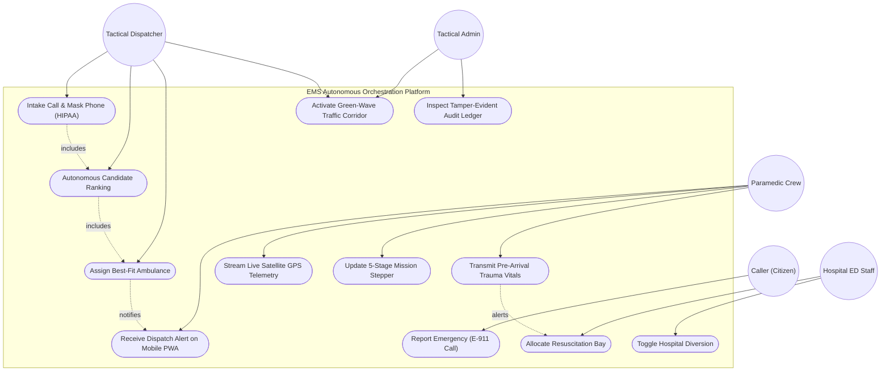

# UML Use Case Diagram — EMS Platform
### Author: **Ashutosh (Ashu)** (Systems Design Architect & UML Specialist)

### Use Case Description Summary
1. **Intake Call & Mask Phone (UC2)**: Handled by Dispatcher with Pushkar's salted phone hasher.
2. **Autonomous Candidate Ranking (UC3)**: Handled by Manish's dispatch scoring algorithm.
3. **Stream Telemetry & 5-Step Stepper (UC7, UC8)**: Handled by Rahul's mobile PWA.
4. **Resus Bay & Hospital Diversion (UC10, UC11)**: Handled by Niraj's Hospital ED Hub.
5. **Inspect Audit Ledger (UC12)**: Handled by Admin through Pushkar's Audit Service.
