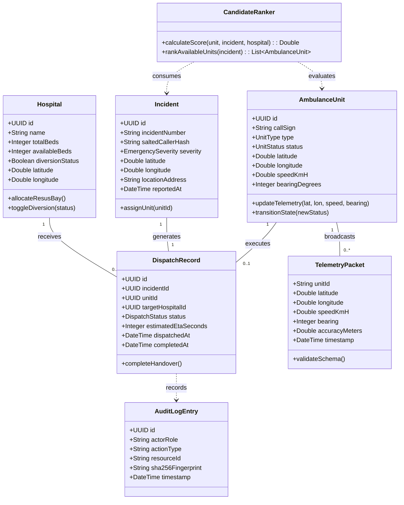

# UML Domain Class Diagram — EMS Platform
### Author: **Ashutosh (Ashu)** (Systems Design Architect & UML Specialist)

### Enumerations & Class Invariants
- `UnitType`: `ALS` (Advanced Life Support), `BLS` (Basic Life Support)
- `UnitStatus`: `AVAILABLE`, `DISPATCHED`, `EN_ROUTE`, `AT_SCENE`, `TRANSPORTING`, `OFFLINE`
- `EmergencySeverity`: `ECHO` (Immediate Catastrophic), `DELTA` (High Acuity), `CHARLIE` (Moderate), `BRAVO` (Low), `ALPHA` (Minor)
