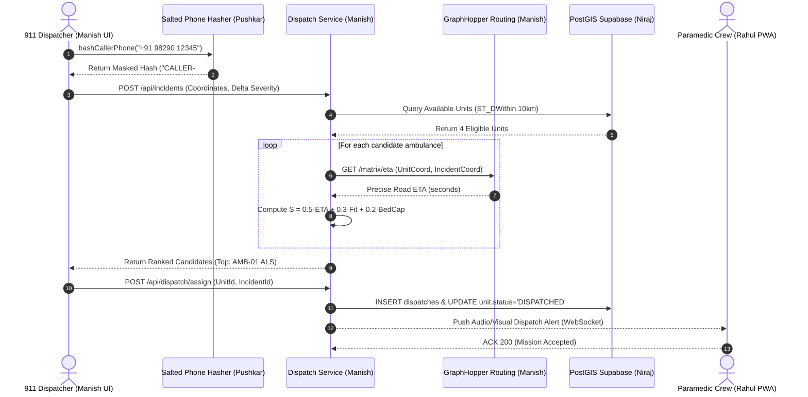
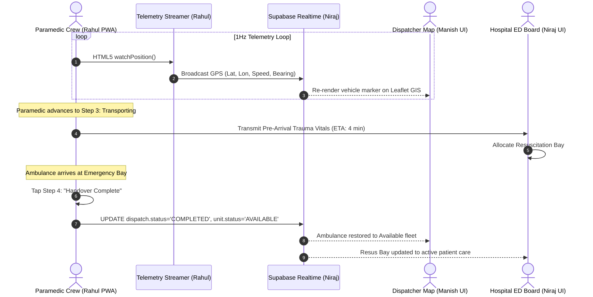

# UML Sequence Diagrams — EMS Platform
### Author: **Ashutosh (Ashu)** (Systems Design Architect & UML Specialist)

## Sequence 1: Incident Intake, Candidate Ranking & Unit Dispatch

## Sequence 2: En Route, GPS Streaming & Hospital Trauma Handover

