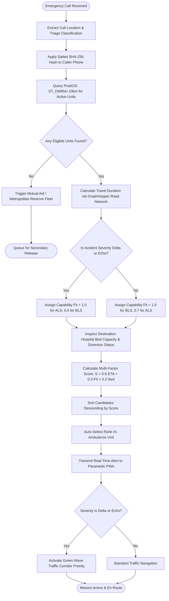

# UML Activity Diagram — Autonomous Candidate Selection Engine
### Author: **Ashutosh (Ashu)** (Systems Design Architect & UML Specialist)

```mermaid
graph TD
 Start([Emergency Call Received]) --> Intake[Extract Call Location & Triage Classification]
 Intake --> HashPhone[Apply Salted SHA-256 Hash to Caller Phone]
 HashPhone --> SpatialFilter[Query PostGIS: ST_DWithin 10km for Active Units]
 
 SpatialFilter --> CheckAvailable{Any Eligible Units Found?}
 CheckAvailable -- No --> AlertSurrounding[Trigger Mutual Aid / Metropolitan Reserve Fleet]
 AlertSurrounding --> EndFail([Queue for Secondary Release])

 CheckAvailable -- Yes --> ComputeLoop[Calculate Travel Duration via GraphHopper Road Network]
 ComputeLoop --> EvalClinical{Is Incident Severity Delta or Echo?}
 
 EvalClinical -- Yes --> PrioritizeALS[Assign Capability Fit = 1.0 for ALS, 0.4 for BLS]
 EvalClinical -- No --> PrioritizeBLS[Assign Capability Fit = 1.0 for BLS, 0.7 for ALS]

 PrioritizeALS --> HospitalPressure[Inspect Destination Hospital Bed Capacity & Diversion Status]
 PrioritizeBLS --> HospitalPressure

 HospitalPressure --> ComputeScore[Calculate Multi-Factor Score: S = 0.5·ETA + 0.3·Fit + 0.2·Bed]
 ComputeScore --> SortRank[Sort Candidates Descending by Score]
 SortRank --> SelectTop[Auto-Select Rank #1 Ambulance Unit]
 
 SelectTop --> TransmitDispatch[Transmit Real-Time Alert to Paramedic PWA]
 TransmitDispatch --> SignalCorridor{Severity is Delta or Echo?}
 SignalCorridor -- Yes --> TriggerGreenWave[Activate Green-Wave Traffic Corridor Priority]
 SignalCorridor -- No --> NormalRoute[Standard Traffic Navigation]

 TriggerGreenWave --> EndSuccess([Mission Active & En Route])
 NormalRoute --> EndSuccess
```
