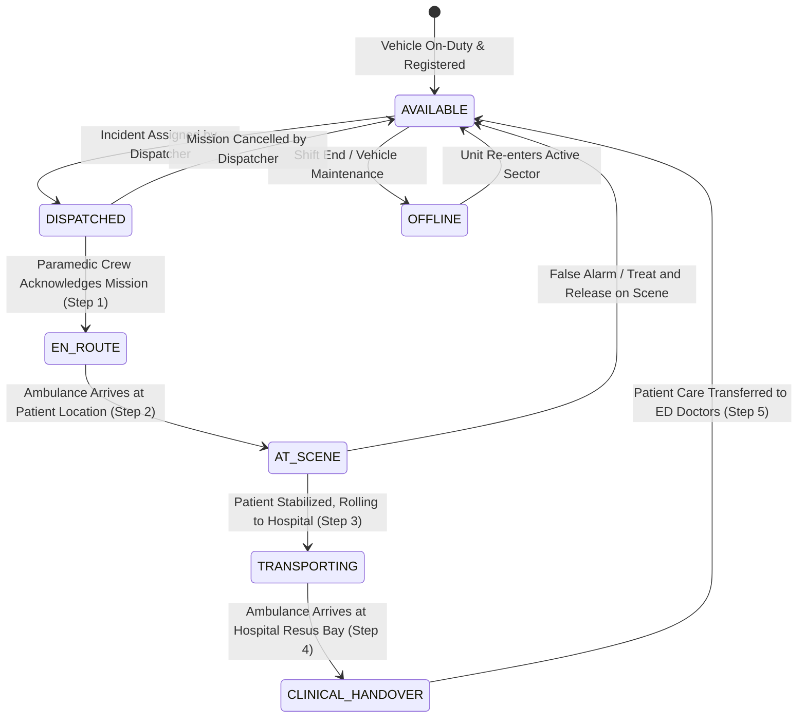

# UML State Machine Diagram — Ambulance Unit Operational Lifecycle
### Author: **Ashutosh (Ashu)** (Systems Design Architect & UML Specialist)

### State Definitions
- **AVAILABLE**: Green status. Parked or patrolling sector base. Eligible for candidate ranking.
- **DISPATCHED**: Yellow pulse. Assignment transmitted. Awaiting crew departure.
- **EN_ROUTE**: Blue status. Rolling with emergency sirens. Turn-by-turn routing active.
- **AT_SCENE**: Purple status. On-scene medical stabilization and vital sign triage.
- **TRANSPORTING**: Coral emergency status. Carrying patient to designated trauma center.
- **CLINICAL_HANDOVER**: Transferring patient responsibility to emergency department doctors.
