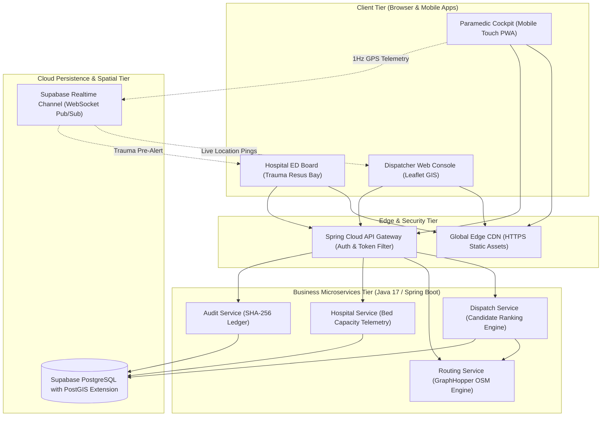

# UML Component & Deployment Architecture Diagram — H8 EMS Platform
### Author: **Ashutosh (Ashu)** (Systems Design Architect & UML Specialist)

```mermaid
graph TB
    subgraph Client_Devices ["Client Tier (Browser & Mobile Apps)"]
        D_UI["Dispatcher Web Console (Leaflet GIS)"]
        C_UI["Paramedic Cockpit (Mobile Touch PWA)"]
        H_UI["Hospital ED Board (Trauma Resus Bay)"]
    end

    subgraph Edge_Gateway ["Edge & Security Tier"]
        CDN["Global Edge CDN (HTTPS Static Assets)"]
        GW["Spring Cloud API Gateway (Auth & Token Filter)"]
    end

    subgraph Microservices_Tier ["Business Microservices Tier (Java 17 / Spring Boot)"]
        DS["Dispatch Service (Candidate Ranking Engine)"]
        RS["Routing Service (GraphHopper OSM Engine)"]
        HS["Hospital Service (Bed Capacity Telemetry)"]
        AS["Audit Service (SHA-256 Ledger)"]
    end

    subgraph Cloud_Data_Tier ["Cloud Persistence & Spatial Tier"]
        DB[(Supabase PostgreSQL with PostGIS Extension)]
        RT["Supabase Realtime Channel (WebSocket Pub/Sub)"]
    end

    D_UI --> CDN
    C_UI --> CDN
    H_UI --> CDN

    D_UI --> GW
    C_UI --> GW
    H_UI --> GW

    GW --> DS
    GW --> RS
    GW --> HS
    GW --> AS

    DS --> RS
    DS --> DB
    HS --> DB
    AS --> DB

    C_UI -.->|1Hz GPS Telemetry| RT
    RT -.->|Live Location Pings| D_UI
    RT -.->|Trauma Pre-Alert| H_UI
```
