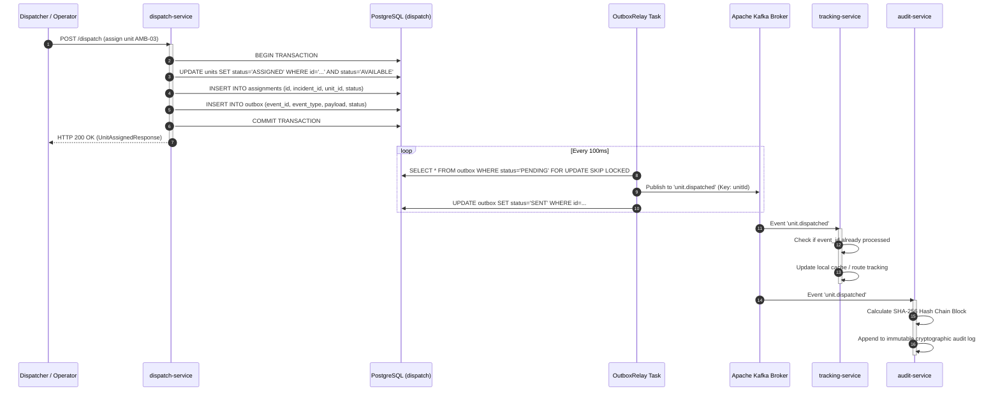

# Chapter 3: System Architecture & Design (ADD)

## 3.1 Architectural Style & Design Principles
The H8 platform is engineered as a **distributed, event-driven microservices architecture** operating on Domain-Driven Design (DDD) principles with Hexagonal (Ports & Adapters) boundaries for the algorithmic core.

```
                           +------------------------+
                           |  Client Web Tier       |
                           |  (Dispatcher, Crew PWA,|
                           |   ED Dashboard)        |
                           +-----------+------------+
                                       |
                                       v
                           +------------------------+
                           |  Nginx / Proxy Tier    |
                           |  Port 8088             |
                           +-----------+------------+
                                       |
                                       v
                           +------------------------+
                           |  Spring Cloud Gateway  |
                           |  Port 8080             |
                           +-----------+------------+
                                       |
        +-------------+----------------+----------------+-------------+
        |             |                |                |             |
        v             v                v                v             v
  +-----------+ +-----------+    +-----------+    +-----------+ +-----------+
  | Incident  | | Dispatch  |    | Tracking  |    | Routing   | | Hospital  |
  | Service   | | Service   |    | Service   |    | Service   | | Service   |
  | Port 8081 | | Port 8082 |    | Port 8083 |    | Port 8084 | | Port 8085 |
  +-----+-----+ +-----+-----+    +-----+-----+    +-----+-----+ +-----+-----+
        |             |                |                |             |
        |             +----------------+----------------+             |
        |             |                                               |
        +-------+-----+-----------------------------------------------+
                |
                v
      +-------------------+       +-------------------+       +-------------------+
      | PostgreSQL 15     |       | Apache Kafka 3.7  |       | Redis 7 Geo       |
      | PostGIS (Spatial) | <---> | Event Bus         | <---> | Spatial Ephemeral |
      | Port 5432         |       | Port 9092         |       | Port 6379         |
      +-------------------+       +-------------------+       +-------------------+
```

---

## 3.2 Service Catalog & Port Topology

The architecture divides operational responsibilities across eight specialized backend microservices, an edge gateway, four data infrastructure containers, and a frontend presentation layer:

| Subsystem / Service | Port | Base Path | Data Store | Primary Responsibility |
| :--- | :--- | :--- | :--- | :--- |
| **API Gateway** | `8080` | `/` | In-Memory / Netty | Reverse proxy, JWT validation, global CORS, path routing |
| **Incident Service** | `8081` | `/incidents` | PostgreSQL (`incident`) | Call intake, triage severity calculation, salted phone hashing |
| **Dispatch Service** | `8082` | `/dispatch` | PostgreSQL (`dispatch`), Redis | Algorithmic scoring, candidate ranking, atomic unit reservations |
| **Tracking Service** | `8083` | `/tracking` | Redis Geo (`units:geo`) | Sub-second GPS ingestion, dead-reckoning extrapolation, TTL |
| **Routing Service** | `8084` | `/routes`, `/matrix`| Embedded GraphHopper | OSM road graph traversal, turn-by-turn ETA, travel matrix |
| **Hospital Service** | `8085` | `/hospitals` | PostgreSQL (`hospital`) | ED bed capacities, diversion management, AlertHub SSE stream |
| **Redeployment Service**| `8086` | `/redeployment`| PostgreSQL (`redeploy`) | MEXCLP coverage optimization, dynamic fleet relocation |
| **Audit Service** | `8087` | `/audit` | PostgreSQL (`audit`) | Cryptographic SHA-256 tamper-evident dispatch ledger |
| **Unified Web / Proxy** | `8088` | `/` | Static HTML5/CSS3/PWA | Serves Dispatcher, Crew PWA, ED Dashboard, and proxies APIs |
| **PostgreSQL (PostGIS)**| `5432` | `jdbc:postgresql` | Disk / Docker Volume | ACID relational storage, spatial geometries (`geography`) |
| **Apache Kafka** | `9092` | `PLAINTEXT` | Disk / Docker Volume | Transactional outbox event streaming, pub/sub topics |
| **Redis In-Memory** | `6379` | `redis://` | RAM / Appendonly | High-speed geospatial indexing, locks, ephemeral caching |
| **Keycloak IAM** | `8180` | `/realms/h8` | PostgreSQL (`keycloak`)| OAuth2 / OpenID Connect authorization server, RBAC |

---

## 3.3 Hexagonal Architecture (Domain Decoupling)

To guarantee high testability and complete independence from transient framework lifecycles, the core algorithms are structured under a strict Hexagonal Architecture model:

```
+-------------------------------------------------------------------------------+
|                       INFRASTRUCTURE / ADAPTERS LAYER                         |
|   Spring Data JPA  *  Kafka Producer  *  Redis Template  *  Spring Web MVC   |
|                                                                               |
|       +---------------------------------------------------------------+       |
|       |                     APPLICATION LAYER                         |       |
|       |      DispatchService  *  IncidentService  *  HospitalService  |       |
|       |                                                               |       |
|       |       +-----------------------------------------------+       |       |
|       |       |                 DOMAIN LAYER                  |       |       |
|       |       |             (Module: 'common')                |       |       |
|       |       |                                               |       |       |
|       |       |   DispatchScorer    *    CoverageModel        |       |       |
|       |       |   DestinationRanker *    AmbulanceUnit        |       |       |
|       |       |   Incident          *    Hospital             |       |       |
|       |       |   Location (lat, lon, timestamp)              |       |       |
|       |       |   CapabilityType (ALS, BLS, CARDIAC, etc.)    |       |       |
|       |       |   Severity (CRITICAL, URGENT, STANDARD)       |       |       |
|       |       |                                               |       |       |
|       |       |          ** PURE JAVA 21 ONLY **              |       |       |
|       |       |       Zero Spring / JPA / Kafka / Redis       |       |       |
|       |       +-----------------------------------------------+       |       |
|       +---------------------------------------------------------------+       |
+-------------------------------------------------------------------------------+
```

### Invariants Maintained by Hexagonal Separation:
1. **Compilation Independence**: The `common` module compiles into a standalone JAR (`common-1.0.0-SNAPSHOT.jar`) without pulling in any transitively coupled frameworks.
2. **Simulator Parity**: The offline Monte Carlo experimentation runner (`simulator` module) imports the exact same `DispatchScorer` and `CoverageModel` classes as production microservices, preventing behavioral divergence.
3. **Execution Speed**: Domain tests execute in milliseconds without launching Spring application contexts or container mocks.

---

## 3.4 Inter-Service Communication Patterns

The H8 architecture applies two distinct communication paradigms depending on transaction requirements:

### 3.4.1 Synchronous REST (Query Path / Latency-Critical)
* **API Gateway -> Microservices**: The gateway terminates external HTTP/2 connections, checks JWT signatures, and routes requests synchronously to the downstream microservices via high-throughput HTTP REST calls.
* **Dispatch Service -> Routing Service**: During candidate ranking, the dispatch engine issues a synchronous HTTP POST to `/routes/matrix` to obtain accurate road travel times from candidate vehicle locations to the incident. If the call exceeds 300 ms, a Resilience4j circuit breaker falls back to Haversine great-circle calculation.

### 3.4.2 Asynchronous Event-Driven (Mutation Path / Zero Data Loss)
* **Transactional Outbox Pattern**: When a business entity changes state (e.g., an incident is triaged or an ambulance is dispatched), the microservice writes both the entity mutation and an outbox event record into its local PostgreSQL database inside a single ACID database transaction.
* **Outbox Polling Publisher**: An internal asynchronous relay component polls the outbox table every 100 ms and transmits the events to Apache Kafka.
* **Idempotent Consumers**: Downstream consumers parse incoming Kafka events and verify whether the event has already been processed by checking an internal `processed_events` table before applying changes.


