# Chapter 5: Complete UML Modeling Suite

## 5.1 Overview of UML Architectural Models
This chapter provides the formal Unified Modeling Language (UML 2.5) specifications for the H8 Emergency Medical Dispatch Platform. It presents complete behavioral, structural, relational, and physical deployment views:

* **Use Case Modeling**: Actor interactions and operational boundaries.
* **Structural Modeling**: Package architecture, component mesh, and domain class structures.
* **Behavioral Modeling**: End-to-end sequence workflows, activity lifecycles, and finite state machines.
* **Data & Physical Modeling**: Entity-Relationship (ER) schemas and production deployment topology.

---

## 5.2 UML Model 1: System Use Case Diagram

```mermaid
graph TD
    subgraph System Boundary: H8 EMS Emergency Dispatch Platform
        UC1(Ingest Emergency Call)
        UC2(Perform MPDS Clinical Triage)
        UC3(Anonymize Caller PII / Salted Hash)
        UC4(Query Ranked Ambulance Candidates)
        UC5(Execute Atomic Unit Reservation)
        UC6(Manual Dispatcher Override)
        UC7(Transmit Live GPS Telemetry)
        UC8(Update Paramedic Mission State)
        UC9(Submit Patient Clinical Vitals)
        UC10(Request Ranked Destination Hospital)
        UC11(Receive Pre-Arrival Alert / SSE)
        UC12(Update Bed Capacity & Diversion)
        UC13(Compute Fleet MEXCLP Coverage)
        UC14(Verify SHA-256 Cryptographic Audit Ledger)
    end

    Caller[Emergency Caller / Bystander] --> UC1
    
    Dispatcher[911 / 108 Emergency Dispatcher] --> UC2
    Dispatcher --> UC4
    Dispatcher --> UC5
    Dispatcher --> UC6
    Dispatcher --> UC13

    UC1 -.-> UC3
    UC2 -.-> UC4
    UC5 -.-> UC14
    UC6 -.-> UC14

    Crew[Paramedic Ambulance Crew] --> UC7
    Crew --> UC8
    Crew --> UC9
    Crew --> UC10

    Doctor[Hospital ED Triage Staff] --> UC11
    Doctor --> UC12

    Auditor[Legal & Compliance Auditor] --> UC14
```

---

## 5.3 UML Model 2: Package & Maven Multi-Module Hierarchy

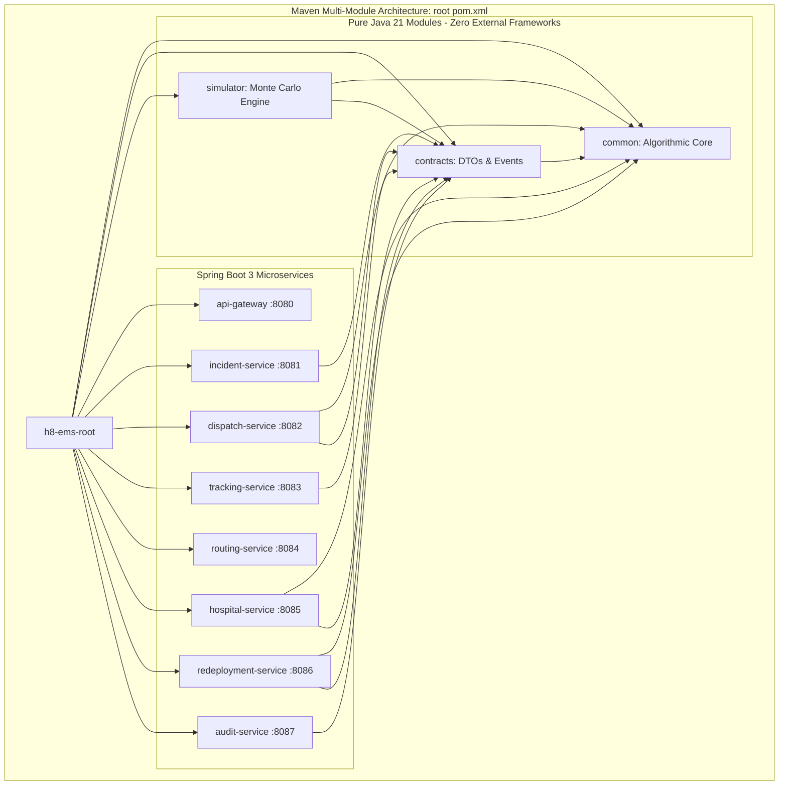

---

## 5.4 UML Model 3: System Component Diagram

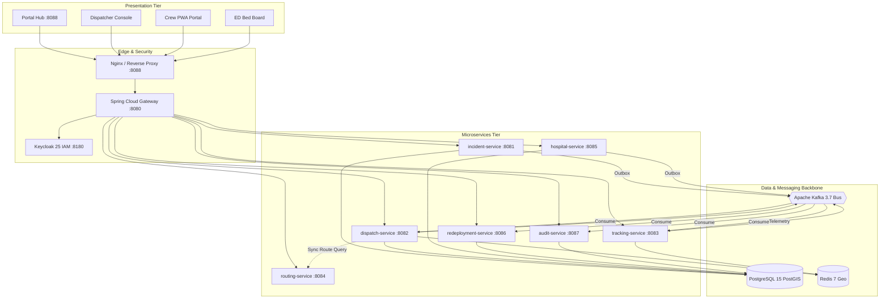

---

## 5.5 UML Model 4: Class Diagram — Core Domain Model (`common`)

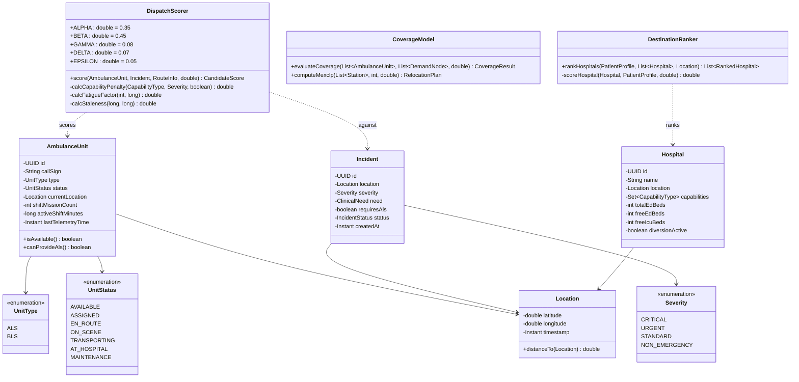

---

## 5.6 UML Model 5: Class Diagram — Dispatch Service & Persistence (`dispatch-service`)

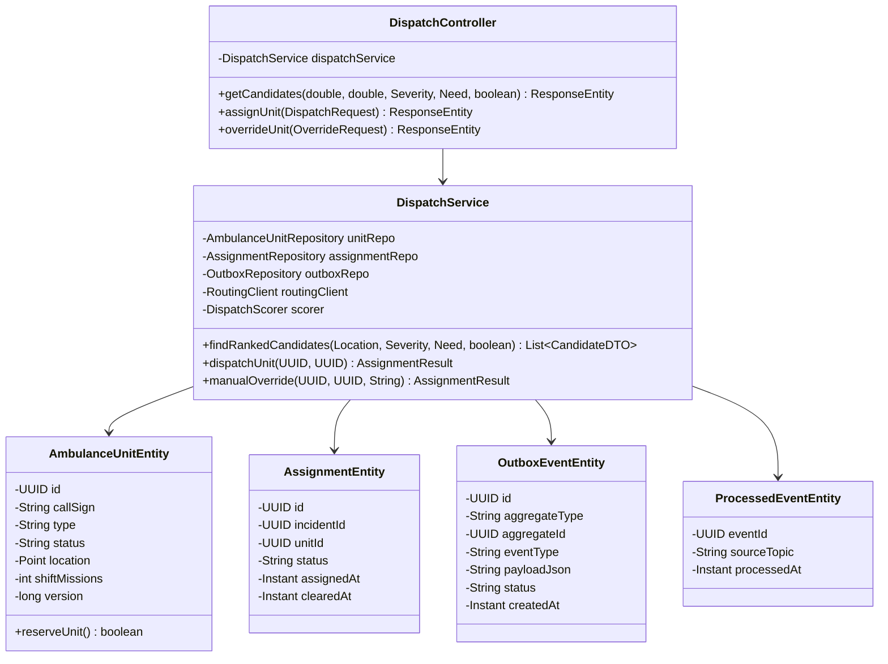

---

## 5.7 UML Model 6: Sequence Diagram — Incident Intake & Automated Triage

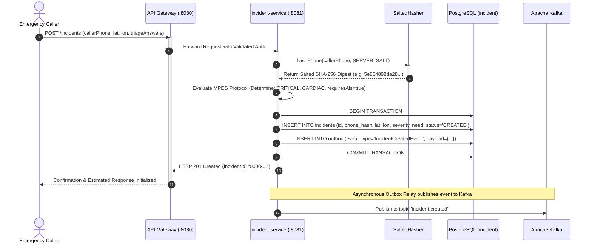

---

## 5.8 UML Model 7: Sequence Diagram — Candidate Scoring & Atomic Reservation

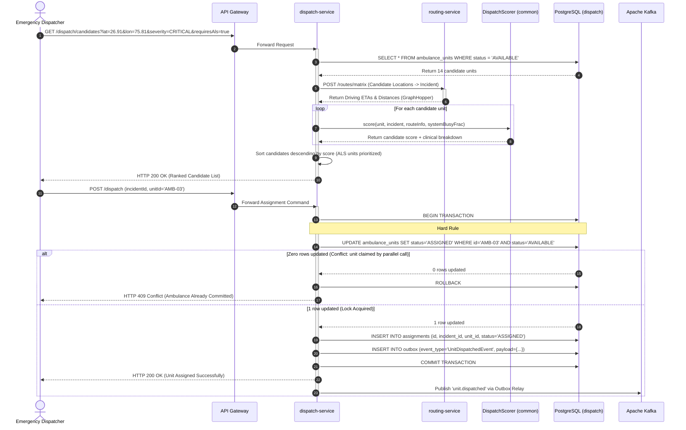

---

## 5.9 UML Model 8: Sequence Diagram — High-Frequency GPS Ingestion

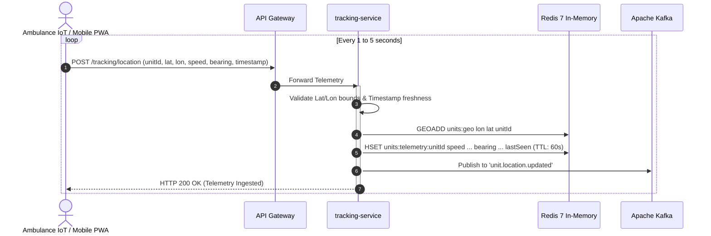

---

## 5.10 UML Model 9: Sequence Diagram — Hospital Destination Ranking & Pre-Arrival Handover

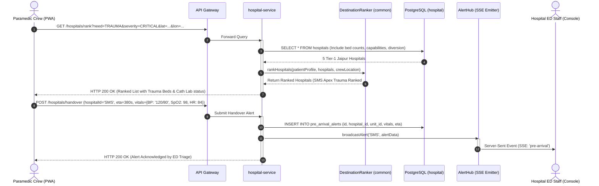

---

## 5.11 UML Model 10: State Machine Diagram — Ambulance Unit Operational Lifecycle

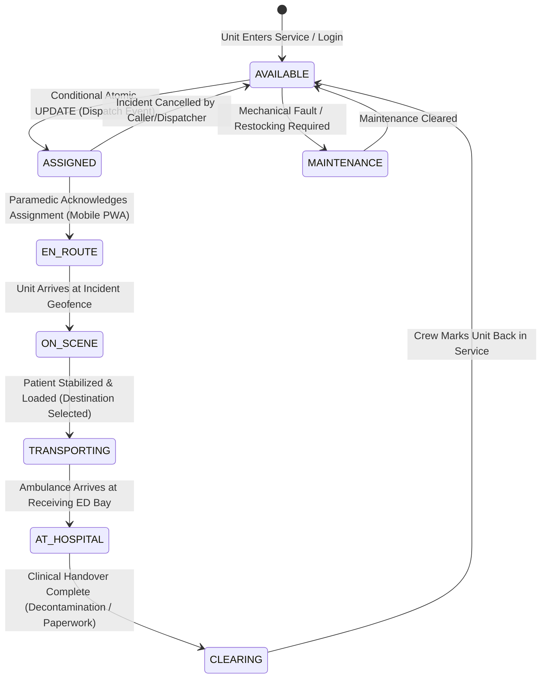

---

## 5.12 UML Model 11: State Machine Diagram — Incident Emergency Lifecycle

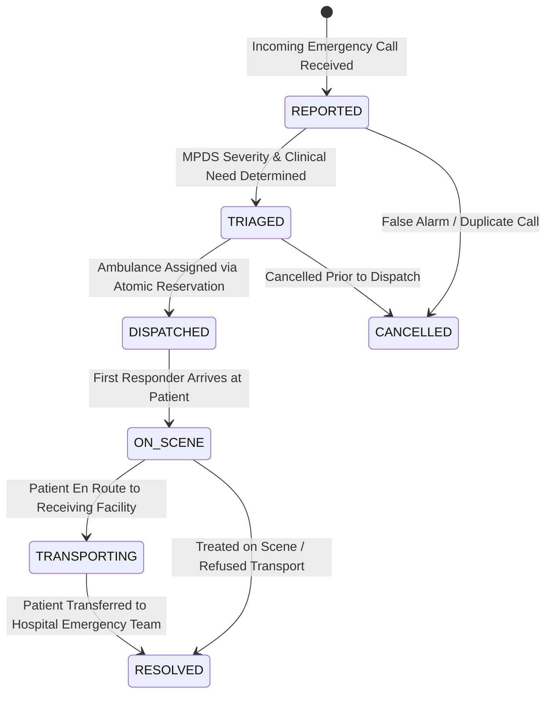

---

## 5.13 UML Model 12: Activity Diagram — End-to-End Emergency Dispatch Workflow

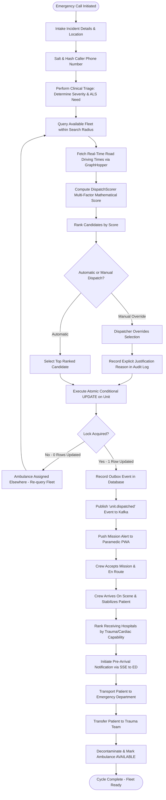

---

## 5.14 UML Model 13: Deployment Diagram — Production Cloud Topology

```mermaid
graph TB
    subgraph Internet & Public Access
        PublicUser[Public Mobile & Web Clients]
    end

    subgraph Cloud Infrastructure / Virtual Private Server (VPS)
        subgraph Ingress & SSL
            CF[Cloudflare Edge / Caddy TLS 1.3]
            NginxIngress[Nginx Reverse Proxy :8088]
        end

        subgraph Docker Bridge Network: h8-net
            GW_Cont[api-gateway :8080]
            
            subgraph Core Services
                IS_Cont[incident-service :8081]
                DS_Cont[dispatch-service :8082]
                TS_Cont[tracking-service :8083]
                RS_Cont[routing-service :8084]
                HS_Cont[hospital-service :8085]
                RD_Cont[redeployment-service :8086]
                AS_Cont[audit-service :8087]
            end

            subgraph Data & Messaging Containers
                PG_Cont[(PostgreSQL 15 PostGIS :5432)]
                Redis_Cont[(Redis 7 Geo :6379)]
                Kafka_Cont{{Apache Kafka 3.7 KRaft :9092}}
                KC_Cont[Keycloak 25 IAM :8180]
            end

            subgraph Monitoring
                Prom_Cont[Prometheus :9090]
                Graf_Cont[Grafana :3000]
            end
        end

        subgraph Persistent Docker Volumes
            Vol_PG[(pgdata Volume)]
            Vol_Graph[(graphhopper-data Volume)]
        end
    end

    PublicUser -->|HTTPS :443| CF
    CF -->|HTTP :8088| NginxIngress
    NginxIngress -->|Proxy /| GW_Cont

    GW_Cont --> CoreServices
    CoreServices --> DataContainers
    
    PG_Cont --> Vol_PG
    RS_Cont --> Vol_Graph

    Prom_Cont -.->|Scrape /actuator/prometheus| CoreServices
    Graf_Cont --> Prom_Cont
```

---

## 5.15 UML Model 14: Entity-Relationship (ER) Diagram — Relational Database Schema

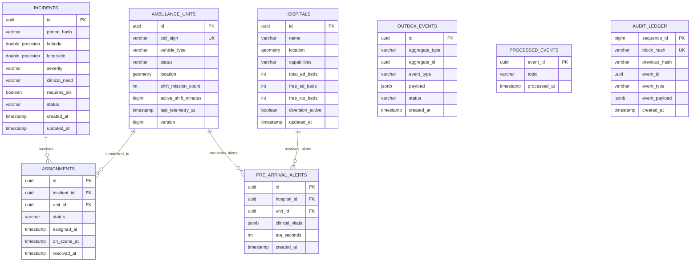
