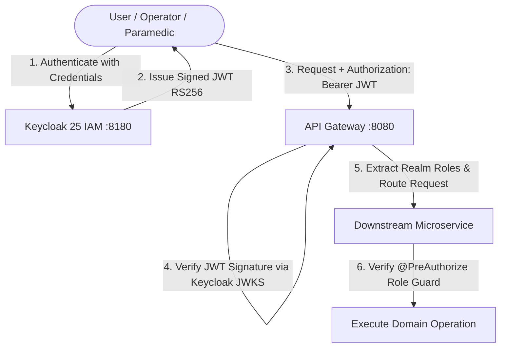

# Chapter 8: Cryptographic Audit Ledger & Security Architecture

## 8.1 Cryptographic Audit Ledger (`audit-service`)

### 8.1.1 The Legal & Clinical Requirement for Immutability
Emergency dispatch decisions are subject to intense legal, medical, and governmental scrutiny. If an ambulance is dispatched with a 20-minute delay and a patient expires, emergency dispatch records are routinely subpoenaed in clinical malpractice litigation. Traditional SQL logs are vulnerable to database administrator manipulation, post-incident record alteration, or silent row deletions.

H8 implements an **append-only, cryptographic SHA-256 hash-chained dispatch ledger**. Any modification, re-ordering, or deletion of a dispatch decision, triage assessment, or manual supervisor override irreversibly breaks the mathematical continuity of the hash chain, immediately exposing tampering.

```
[ Genesis Block (0000...00) ]
              |
              v
[ Block 1: IncidentCreatedEvent ] ---> Hash: H1 = SHA256(H0 + Event1 + Payload1)
              |
              v
[ Block 2: CandidateRankedEvent ] ---> Hash: H2 = SHA256(H1 + Event2 + Payload2)
              |
              v
[ Block 3: UnitDispatchedEvent  ] ---> Hash: H3 = SHA256(H2 + Event3 + Payload3)
              |
              v
[ Block 4: OverrideLoggedEvent  ] ---> Hash: H4 = SHA256(H3 + Event4 + Payload4)
```

---

### 8.1.2 Mathematical Hash Chain Formulation
Each entry $i \in \{1, 2, \dots, N\}$ in the ledger contains:
* Sequence index $i \in \mathbb{N}$
* Previous block hash $H_{i-1} \in \{0, 1\}^{256}$
* Event UUID $E_i$
* Canonical JSON serialized event payload $P_i$
* ISO-8601 epoch timestamp $T_i$

The cryptographic block hash $H_i$ is computed as:

$$H_i = \text{SHA-256}\Big( H_{i-1} \parallel E_i \parallel P_i \parallel T_i \Big)$$

For the genesis block ($i = 0$):
$$H_0 = \text{"0000000000000000000000000000000000000000000000000000000000000000"}$$

### 8.1.3 Mathematical Tamper Detection
Suppose an adversary modifies the payload of block $k$ from $P_k$ to $P_k'$ where $1 \le k < N$:
1. The adversary's modified block now has signature $H_k' = \text{SHA256}(H_{k-1} \parallel E_k \parallel P_k' \parallel T_k) \ne H_k$.
2. In block $k+1$, the stored predecessor hash is $H_k$, but the actual hash of block $k$ is now $H_k'$.
3. When the verification algorithm recalculates $\tilde{H}_{k+1} = \text{SHA256}(H_k' \parallel E_{k+1} \parallel P_{k+1} \parallel T_{k+1})$, $\tilde{H}_{k+1} \ne H_{k+1}$.
4. The mismatch cascades through all subsequent blocks up to $N$. An attacker cannot forge the chain without recomputing the entire history and modifying external notarization anchors.

---

### 8.1.4 Verification Algorithm Implementation
```java
public class AuditChainVerifier {
    public static final String GENESIS_HASH = "0".repeat(64);

    public VerificationResult verifyLedger(List<AuditLedgerEntity> blocks) {
        String expectedPreviousHash = GENESIS_HASH;

        for (int i = 0; i < blocks.size(); i++) {
            AuditLedgerEntity current = blocks.get(i);

            // 1. Verify previous hash pointer
            if (!current.getPreviousHash().equals(expectedPreviousHash)) {
                return new VerificationResult(false, i, "Broken previous hash link at sequence " + current.getSequenceId());
            }

            // 2. Recompute expected hash
            String calculatedHash = sha256(
                current.getPreviousHash() +
                current.getEventId().toString() +
                current.getEventPayload() +
                current.getCreatedAt().toEpochMilli()
            );

            // 3. Verify block signature
            if (!calculatedHash.equalsIgnoreCase(current.getBlockHash())) {
                return new VerificationResult(false, i, "Hash mismatch at sequence " + current.getSequenceId());
            }

            expectedPreviousHash = current.getBlockHash();
        }

        return new VerificationResult(true, blocks.size(), "All block signatures mathematically verified.");
    }
}
```

---

## 8.2 Security Architecture & Identity Management (Keycloak 25)

The platform enforces authentication and Role-Based Access Control (RBAC) across all tiers via Keycloak 25.



### 8.2.1 Role-Based Access Control Matrix

| System Action / Resource Endpoint | `DISPATCHER` | `CREW` | `HOSPITAL_STAFF` | `AUDITOR` |
| :--- | :---: | :---: | :---: | :---: |
| `POST /incidents` (Create Call) | **ALLOWED** | DENIED | DENIED | DENIED |
| `GET /dispatch/candidates` | **ALLOWED** | DENIED | DENIED | DENIED |
| `POST /dispatch` (Assign Ambulance) | **ALLOWED** | DENIED | DENIED | DENIED |
| `POST /dispatch/override` (Supervisor) | **ALLOWED** | DENIED | DENIED | DENIED |
| `POST /tracking/location` (GPS Feed) | DENIED | **ALLOWED** | DENIED | DENIED |
| `POST /dispatch/units/{id}/status` | DENIED | **ALLOWED** | DENIED | DENIED |
| `GET /hospitals/rank` | **ALLOWED** | **ALLOWED** | DENIED | DENIED |
| `POST /hospitals/handover` (Pre-Arrival)| DENIED | **ALLOWED** | DENIED | DENIED |
| `PUT /hospitals/{id}/beds` | DENIED | DENIED | **ALLOWED** | DENIED |
| `POST /hospitals/{id}/diversion` | DENIED | DENIED | **ALLOWED** | DENIED |
| `GET /audit/verify` (Audit Ledger) | DENIED | DENIED | DENIED | **ALLOWED** |

---

## 8.3 Patient Privacy & Caller Data Anonymization (HIPAA / DISHA)

### 8.3.1 Salted Cryptographic Phone Hashing
In full compliance with international health privacy standards (HIPAA Security Rule 45 CFR Part 164) and India's Digital Information Security in Healthcare Act (DISHA):
* **No Plaintext Phone Storage**: The caller's telephone number is never stored in any relational column, Redis key, Kafka payload, or log file.
* **Server-Side Salt Injection**: Upon call intake, the string is salted with a cryptographically secure random 256-bit server secret and hashed:

$$\text{PhoneHash} = \text{HMAC-SHA256}(\text{CallerPhone}, \text{SecretSalt})$$

* **De-Duplication Without Identification**: If the same citizen calls 10 minutes later regarding the same emergency, the system calculates the identical phone hash, enabling rapid incident deduplication without ever exposing the individual's legal phone number to operators or database breaches.
